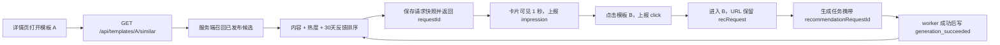

# 相似模板推荐闭环优化实施计划

> **For agentic workers:** REQUIRED SUB-SKILL: Use superpowers:subagent-driven-development (recommended) or superpowers:executing-plans to implement this plan task-by-task. Steps use checkbox (`- [ ]`) syntax for tracking.

**Goal:** 将详情页“相似模板”从前端静态分类/tag 排序升级为服务端可解释推荐，并让曝光、点击、成功生成行为回流到后续排序，形成可观测、可迭代的最小推荐闭环。

**Architecture:** PostgreSQL 保存推荐请求快照和行为事件；Hono 服务端负责候选召回、内容评分、行为反馈评分与推荐理由；React 详情页消费推荐接口并通过 IntersectionObserver 上报真实曝光。成功生成事件由 worker 以生成任务为幂等键写入，避免客户端伪造核心转化。第一版继续使用 PostgreSQL、Drizzle 和 TypeScript，不引入向量数据库、消息总线、用户画像或机器学习平台。

**Tech Stack:** React 19、TypeScript、Hono、Drizzle ORM 0.45、PostgreSQL、BullMQ、Zod、Node test runner。

## Global Constraints

- 只推荐 `status = 'published' AND deleted_at IS NULL` 的模板，并排除当前模板。
- 候选模板必须与当前模板 `workflowType` 相同；内容相关分低于 25 分时不得为了凑满 4 个而返回无关模板。
- 推荐结果最多 4 个，顺序必须稳定；最终同分时依次使用 `useCount DESC`、`createdAt DESC`、`id ASC`。
- 推荐解释只能来自实际参与评分的字段，不生成虚假的自然语言理由。
- `generation_succeeded` 只能由 worker 在生成成功后写入，客户端只能上报 `impression` 和 `click`。
- 所有推荐事件必须关联服务端生成的推荐请求，且目标模板必须存在于该请求的候选快照中。
- 原始推荐事件保留 180 天；本计划不采集用户身份、IP、浏览历史或输入的 Prompt 内容。
- API 或事件上报失败不得阻断详情页、模板跳转和生成主流程。
- 第一版算法版本固定为 `similar-v1`; 修改权重时必须升级版本字符串。
- 前端静态 `getSimilarTemplates()` 仅作为一个版本周期内的接口失败兜底，闭环稳定后删除。

---

## 1. 当前基线与问题

当前实现位于 `apps/web/src/data/templates.ts:getSimilarTemplates()`：同分类加 3 分，每个重合 tag 加 1 分，排序后取前 4 个。它存在五个结构性缺口：

1. 候选池来自前端静态数组，后台新增或下架模板无法实时反映。
2. 没有最低相关度门槛，可能返回 0 分模板。
3. 已存在的 `outputType/scenario/style/subject` 语义分类没有用于推荐。
4. 推荐曝光、点击和生成成功之间没有统一请求 ID，无法计算 CTR、生成转化率或位置表现。
5. worker 虽然会递增 `useCount`，但详情页推荐排序不读取该模板在“当前来源模板”下的表现。

现有未保存修改保护、响应式推荐栏和详情跳转继续保留，不属于本次重写范围。

## 2. 目标数据流



## 3. 推荐算法 v1

### 3.1 候选召回

从数据库召回最多 200 个候选，必须满足：

- 已发布、未软删除；
- 排除当前模板；
- `workflowType` 相同；
- 至少满足一个条件：相同 `outputType`、共享 scenario/style/subject 词项、相同 legacy category、存在重合 tag。

召回后在 TypeScript 纯函数中评分。内容分小于 25 的候选删除；不足 4 个时允许返回 0–3 个结果。

### 3.2 可解释评分

| 因子 | 分值 | 上限 |
|---|---:|---:|
| 相同 output type | +35 | 35 |
| 每个共享 scenario | +9 | 18 |
| 每个共享 style | +8 | 16 |
| 每个共享 subject | +6 | 12 |
| tag Jaccard 相似度 | `12 × intersection / union` | 12 |
| 相同 legacy category | +5 | 5 |
| 使用热度 | `min(8, ln(1+useCount)/ln(5001)×8)` | 8 |
| 收藏热度 | `min(4, ln(1+favoriteCount)/ln(2001)×4)` | 4 |
| 90 天新鲜度 | `max(0, 4×(1-ageDays/90))` | 4 |
| 来源→候选 30 天生成转化 | `8×(success+2)/(click+10)` | 8 |
| 来源→候选 30 天点击率 | `4×(click+3)/(impression+20)` | 4 |

最终分数为以上分项之和。CTR/CVR 使用固定先验，避免低样本模板因一次点击或生成获得极端高分；反馈总贡献最多 12 分，确保内容相关性始终是主导因素。

### 3.3 推荐理由

按实际得分从高到低选取最多两个理由：

- `same_output_type` → `同为{输出类型}`
- `shared_scenario` → `适合{场景}`
- `shared_style` → `相近{风格}风格`
- `shared_subject` → `同类{主体}`
- `shared_tags` → `共享{标签}`
- `popular` → `近期常用`

API 同时返回机器可读 `reasonCodes` 和可直接展示的 `reasonLabel`。热度不能覆盖语义理由；只有没有语义标签可展示时才使用“近期常用”。

## 4. API 合约

### 获取推荐

`GET /api/templates/:id/similar?limit=4`

```json
{
  "data": {
    "requestId": "7dc9b55b-a1d0-4ef2-b52f-4c99d527678e",
    "algorithmVersion": "similar-v1",
    "items": [
      {
        "template": { "id": "tpl-portrait-studio", "name": "棚拍时尚肖像" },
        "score": 79.42,
        "position": 1,
        "reasonCodes": ["same_output_type", "shared_style"],
        "reasonLabel": "同为人像 · 相近电影感风格"
      }
    ]
  }
}
```

响应中的 `template` 使用完整 `publicTemplateSchema`。源模板不存在返回 `404 NOT_FOUND`；`limit` 非 1–12 的整数返回 `400 INVALID_LIMIT`。

### 上报客户端事件

`POST /api/templates/:id/recommendation-events`

```json
{
  "requestId": "7dc9b55b-a1d0-4ef2-b52f-4c99d527678e",
  "eventType": "click",
  "recommendedTemplateId": "tpl-portrait-studio"
}
```

服务端从请求快照推导 `position`、算法版本和 source template；不信任客户端传入这些字段。重复事件返回原结果，HTTP 200；过期或不匹配请求返回 `409 RECOMMENDATION_REQUEST_INVALID`。

### 生成归因

现有 `POST /api/generations` 输入增加可选字段：

```json
{
  "recommendationRequestId": "7dc9b55b-a1d0-4ef2-b52f-4c99d527678e"
}
```

API 验证当前 `templateId` 在该推荐请求中后，将 request ID 保存在 `generation_jobs.input`。worker 生成成功时写入 `generation_succeeded`，幂等键为 `generation:{jobId}`。

## 5. 数据库设计

### `template_recommendation_requests`

- `id uuid primary key default gen_random_uuid()`
- `source_template_id text not null references prompt_templates(id)`
- `algorithm_version text not null`
- `candidate_ids text[] not null`
- `score_snapshot jsonb not null`
- `created_at timestamptz not null default now()`
- `expires_at timestamptz not null`

### `template_recommendation_events`

- `id uuid primary key default gen_random_uuid()`
- `request_id uuid not null references template_recommendation_requests(id) on delete cascade`
- `source_template_id text not null references prompt_templates(id)`
- `recommended_template_id text not null references prompt_templates(id)`
- `event_type text not null check in ('impression','click','generation_succeeded')`
- `position integer not null check between 1 and 12`
- `generation_job_id uuid references generation_jobs(id) on delete set null`
- `dedupe_key text not null unique`
- `created_at timestamptz not null default now()`

必要索引：

- requests：`(source_template_id, created_at desc)`、`(expires_at)`
- events：`(source_template_id, recommended_template_id, event_type, created_at desc)`、`(request_id, created_at)`、`dedupe_key unique`

## 6. 文件结构

### 新建

- `packages/shared/test/recommendation-contracts.test.mjs`：共享 API 合约测试。
- `apps/api/src/lib/template-semantics.ts`：从模板与 taxonomy assignments 生成语义视图。
- `apps/api/src/lib/similar-template-ranking.ts`：无数据库依赖的纯评分函数。
- `apps/api/src/services/similar-template-service.ts`：召回、事件统计、请求快照和响应组装。
- `apps/api/drizzle/0016_similar_template_recommendation_loop.sql`：推荐请求与事件表。
- `apps/api/test/similar-template-ranking.test.mjs`：评分、门槛、稳定排序测试。
- `apps/api/test/similar-template-recommendation.test.mjs`：路由与过滤契约测试。
- `apps/api/test/recommendation-events.test.mjs`：事件验证和幂等测试。
- `apps/worker/test/recommendation-attribution.test.mjs`：成功生成归因测试。
- `apps/web/src/hooks/useSimilarTemplates.ts`：推荐加载、失败兜底和请求上下文。
- `apps/web/src/hooks/useRecommendationImpression.ts`：50% 可见持续 1 秒的曝光上报。
- `apps/web/test/similar-template-recommendation-flow.test.ts`：前端推荐请求、曝光、点击和 URL 归因测试。

### 修改

- `packages/shared/src/index.ts`：增加推荐响应、事件和生成归因 schema。
- `apps/api/src/db/schema.ts`：增加推荐数据表。
- `apps/api/src/routes/templates.ts`：增加 similar 与 event 路由，复用抽取后的语义读取器。
- `apps/api/src/routes/generations.ts`：验证推荐请求并把 request ID 写入任务输入。
- `apps/worker/src/generated-media.ts`：生成成功后幂等写入推荐转化事件。
- `apps/web/src/data/templateApi.ts`：增加推荐与事件 API client。
- `apps/web/src/pages/DetailPage.tsx`：用服务端推荐替代默认静态排序，读取 `recRequest`。
- `apps/web/src/components/detail/PromptStudioDetail.tsx`：传递推荐 item 和归因上下文。
- `apps/web/src/components/detail/SimilarTemplateRail.tsx`：渲染推荐理由并触发曝光。
- `apps/web/src/components/detail/SimilarTemplateCompactCard.tsx`：点击上报并携带 `recRequest` 导航。
- `apps/web/src/components/detail/GenerationActions.tsx` 相关调用链：生成时携带推荐 request ID。
- `apps/web/src/data/templates.ts`：标记静态推荐为兼容兜底，并在闭环稳定后删除。
- `docs/ops.md`：增加指标查询、事件保留和回滚说明。

---

### Task 1: 定义共享推荐合约与纯评分器

**Files:**
- Modify: `packages/shared/src/index.ts`
- Create: `packages/shared/test/recommendation-contracts.test.mjs`
- Create: `apps/api/src/lib/similar-template-ranking.ts`
- Create: `apps/api/test/similar-template-ranking.test.mjs`

**Interfaces:**
- Produces: `similarTemplateResponseSchema`, `recommendationEventInputSchema`, `recommendationContextSchema`, `rankSimilarTemplates(input)`。
- Consumes: 现有 `publicTemplateSchema` 和 `SemanticClassification`。

- [ ] **Step 1: 写共享合约失败测试**

```js
import assert from 'node:assert/strict';
import test from 'node:test';
import {
  recommendationContextSchema,
  recommendationEventInputSchema,
  similarTemplateResponseSchema,
} from '../dist/index.js';

test('recommendation contracts reject untrusted ranking fields', () => {
  assert.equal(recommendationEventInputSchema.safeParse({
    requestId: crypto.randomUUID(),
    eventType: 'click',
    recommendedTemplateId: 'tpl-b',
    position: 99,
  }).success, false);
  assert.equal(recommendationContextSchema.safeParse({
    recommendationRequestId: crypto.randomUUID(),
  }).success, true);
  assert.equal(similarTemplateResponseSchema.shape.algorithmVersion.parse('similar-v1'), 'similar-v1');
});
```

- [ ] **Step 2: 运行测试并确认失败**

Run: `npm run build -w @promptix/shared && node --test packages/shared/test/recommendation-contracts.test.mjs`

Expected: FAIL，提示推荐 schema 尚未导出。

- [ ] **Step 3: 在共享包加入精确 schema**

```ts
export const recommendationReasonCodeSchema = z.enum([
  'same_output_type', 'shared_scenario', 'shared_style',
  'shared_subject', 'shared_tags', 'popular',
]);
export const similarTemplateItemSchema = z.object({
  template: publicTemplateSchema,
  score: z.number().finite().nonnegative(),
  position: z.number().int().min(1).max(12),
  reasonCodes: z.array(recommendationReasonCodeSchema).min(1).max(2),
  reasonLabel: z.string().min(1).max(120),
});
export const similarTemplateResponseSchema = z.object({
  requestId: z.string().uuid(),
  algorithmVersion: z.literal('similar-v1'),
  items: z.array(similarTemplateItemSchema).max(12),
});
export const recommendationEventInputSchema = z.object({
  requestId: z.string().uuid(),
  eventType: z.enum(['impression', 'click']),
  recommendedTemplateId: z.string().min(1).max(120),
}).strict();
export const recommendationContextSchema = z.object({
  recommendationRequestId: z.string().uuid(),
});
export type SimilarTemplateResponse = z.infer<typeof similarTemplateResponseSchema>;
export type SimilarTemplateItem = z.infer<typeof similarTemplateItemSchema>;
```

将 `publicGenerationCreateSchema` 扩展为：

```ts
export const publicGenerationCreateSchema = z.object({
  templateId: z.string().min(1),
  values: z.record(z.string(), z.string()),
  promptOverride: z.string().max(20_000).optional(),
  clientRequestId: z.string().uuid(),
  recommendationRequestId: z.string().uuid().optional(),
});
```

- [ ] **Step 4: 写评分器失败测试，覆盖内容优先、反馈封顶、最低门槛和稳定同分排序**

```js
test('content relevance dominates behavioral feedback', () => {
  const ranked = rankSimilarTemplates({
    source,
    candidates: [highContent, lowContentHighClicks],
    feedback: new Map([['low', { impressions: 100, clicks: 90, successes: 80 }]]),
    now: new Date('2026-07-23T00:00:00Z'),
    limit: 4,
  });
  assert.equal(ranked[0].template.id, highContent.id);
  assert.ok(ranked.every((item) => item.contentScore >= 25));
});
```

- [ ] **Step 5: 实现 `rankSimilarTemplates()`**

实现为纯函数，输入 source、候选、30 天反馈、当前时间与 limit；输出必须包含 `contentScore`、`score`、`reasonCodes`、`reasonLabel`。所有权重严格使用本文第 3 节数值，最终使用以下稳定排序：

```ts
ranked.sort((a, b) =>
  b.score - a.score ||
  b.template.useCount - a.template.useCount ||
  Date.parse(b.template.createdAt) - Date.parse(a.template.createdAt) ||
  a.template.id.localeCompare(b.template.id),
);
```

- [ ] **Step 6: 运行共享与评分测试**

Run: `npm run build -w @promptix/shared && npm run build -w @promptix/api && node --test packages/shared/test/recommendation-contracts.test.mjs apps/api/test/similar-template-ranking.test.mjs`

Expected: PASS。

- [ ] **Step 7: Commit**

```bash
git add packages/shared/src/index.ts packages/shared/test/recommendation-contracts.test.mjs apps/api/src/lib/similar-template-ranking.ts apps/api/test/similar-template-ranking.test.mjs
git commit -m "feat: define similar template ranking contracts"
```

### Task 2: 增加推荐请求与事件数据表

**Files:**
- Modify: `apps/api/src/db/schema.ts`
- Create: `apps/api/drizzle/0016_similar_template_recommendation_loop.sql`
- Create: `apps/api/test/recommendation-migration.test.mjs`
- Modify: `apps/api/drizzle/meta/_journal.json`

**Interfaces:**
- Produces: `templateRecommendationRequests`, `templateRecommendationEvents` Drizzle 表对象。

- [ ] **Step 1: 写迁移失败测试**

测试必须读取 SQL 并断言两张表、三个外键、事件类型 check、position check、dedupe unique 和统计索引存在。

```js
assert.match(sql, /create table "template_recommendation_requests"/i);
assert.match(sql, /create table "template_recommendation_events"/i);
assert.match(sql, /impression.*click.*generation_succeeded/is);
assert.match(sql, /unique.*dedupe_key/is);
assert.match(sql, /source_template_id.*recommended_template_id.*event_type.*created_at/is);
```

- [ ] **Step 2: 运行并确认失败**

Run: `node --test apps/api/test/recommendation-migration.test.mjs`

Expected: FAIL，迁移文件不存在。

- [ ] **Step 3: 在 schema 中增加两张表并生成迁移**

使用本文第 5 节字段，`expiresAt` 固定为创建后 24 小时；`scoreSnapshot` 保存以下结构：

```ts
type RecommendationScoreSnapshot = Array<{
  templateId: string;
  position: number;
  contentScore: number;
  finalScore: number;
  reasonCodes: string[];
}>;
```

Run: `npm run db:generate -w @promptix/api`

将生成文件命名为 `0016_similar_template_recommendation_loop.sql`，并保持 journal 索引连续。

- [ ] **Step 4: 验证迁移**

Run: `node --test apps/api/test/recommendation-migration.test.mjs && npm run build -w @promptix/api`

Expected: PASS，TypeScript 无 schema 类型错误。

- [ ] **Step 5: Commit**

```bash
git add apps/api/src/db/schema.ts apps/api/drizzle apps/api/test/recommendation-migration.test.mjs
git commit -m "feat: persist recommendation requests and events"
```

### Task 3: 抽取语义读取器并实现推荐服务

**Files:**
- Create: `apps/api/src/lib/template-semantics.ts`
- Create: `apps/api/src/services/similar-template-service.ts`
- Modify: `apps/api/src/routes/templates.ts`
- Create: `apps/api/test/similar-template-recommendation.test.mjs`

**Interfaces:**
- Produces: `loadTemplateSemanticViews(rows)`, `getSimilarTemplateResponse(sourceId, limit)`。
- Consumes: Task 1 ranker、Task 2 表、现有 taxonomy assignments。

- [ ] **Step 1: 写服务失败测试**

覆盖：只返回 published/non-deleted/same-workflow、排除 source、低于 25 分删除、最多 limit 条、写入请求快照、空结果仍返回 requestId。

- [ ] **Step 2: 运行并确认失败**

Run: `npm run build -w @promptix/api && node --test apps/api/test/similar-template-recommendation.test.mjs`

Expected: FAIL，服务模块不存在。

- [ ] **Step 3: 把 `semanticViews()` 从 routes 抽到独立模块**

导出签名：

```ts
export async function loadTemplateSemanticViews(
  rows: Array<typeof promptTemplates.$inferSelect>,
): Promise<Map<string, SemanticClassification>>;
```

原列表、详情和管理接口全部改为调用该函数，返回结构不得变化。

- [ ] **Step 4: 实现推荐服务**

服务执行顺序固定为：加载 source → SQL 召回至多 200 条 → 批量加载语义 → 聚合 30 天事件 → 调用 ranker → 事务写 request snapshot → 返回完整 public template。

30 天统计 SQL 必须按来源和候选成对聚合：

```sql
select recommended_template_id,
  count(*) filter (where event_type = 'impression')::int as impressions,
  count(*) filter (where event_type = 'click')::int as clicks,
  count(*) filter (where event_type = 'generation_succeeded')::int as successes
from template_recommendation_events
where source_template_id = $1
  and recommended_template_id = any($2)
  and created_at >= now() - interval '30 days'
group by recommended_template_id;
```

- [ ] **Step 5: 增加 GET 路由**

必须在 `get('/:id')` 之前注册：

```ts
publicTemplateRoutes.get('/:id/similar', async (c) => {
  const limit = Number(c.req.query('limit') ?? 4);
  if (!Number.isInteger(limit) || limit < 1 || limit > 12) {
    return fail(c, 'INVALID_LIMIT', 'limit must be an integer between 1 and 12', 400);
  }
  const result = await getSimilarTemplateResponse(c.req.param('id'), limit);
  return result ? ok(c, result) : fail(c, 'NOT_FOUND', 'Template not found', 404);
});
```

- [ ] **Step 6: 运行 API 测试**

Run: `npm run test -w @promptix/api`

Expected: 全部 API 测试 PASS，现有列表和详情响应不变。

- [ ] **Step 7: Commit**

```bash
git add apps/api/src/lib/template-semantics.ts apps/api/src/services/similar-template-service.ts apps/api/src/routes/templates.ts apps/api/test/similar-template-recommendation.test.mjs
git commit -m "feat: serve explainable similar templates"
```

### Task 4: 接收曝光和点击事件

**Files:**
- Modify: `apps/api/src/routes/templates.ts`
- Create: `apps/api/src/services/recommendation-event-service.ts`
- Create: `apps/api/test/recommendation-events.test.mjs`

**Interfaces:**
- Produces: `recordClientRecommendationEvent(input)`。
- Consumes: `recommendationEventInputSchema` 与请求快照。

- [ ] **Step 1: 写事件失败测试**

覆盖：有效 impression/click、相同事件幂等、source 不匹配拒绝、候选不在快照拒绝、24 小时过期拒绝、客户端额外传 position 被 strict schema 拒绝。

- [ ] **Step 2: 运行并确认失败**

Run: `npm run build -w @promptix/api && node --test apps/api/test/recommendation-events.test.mjs`

Expected: FAIL，事件服务不存在。

- [ ] **Step 3: 实现事件服务**

幂等键由服务端构造：

```ts
const dedupeKey = `${eventType}:${requestId}:${recommendedTemplateId}`;
```

先读取 request，验证 `sourceTemplateId`、`expiresAt`、`candidateIds`，再从 `scoreSnapshot` 找 position；使用 `onConflictDoNothing({ target: templateRecommendationEvents.dedupeKey })` 插入。

- [ ] **Step 4: 增加 POST 路由**

```ts
publicTemplateRoutes.post('/:id/recommendation-events', async (c) => {
  const parsed = recommendationEventInputSchema.safeParse(await c.req.json().catch(() => null));
  if (!parsed.success) return fail(c, 'VALIDATION_ERROR', parsed.error.issues[0]?.message ?? 'Invalid event', 400);
  const result = await recordClientRecommendationEvent({
    sourceTemplateId: c.req.param('id'),
    ...parsed.data,
  });
  return result.ok
    ? ok(c, { recorded: result.recorded })
    : fail(c, 'RECOMMENDATION_REQUEST_INVALID', result.reason, 409);
});
```

- [ ] **Step 5: 验证并提交**

Run: `npm run test -w @promptix/api`

```bash
git add apps/api/src/routes/templates.ts apps/api/src/services/recommendation-event-service.ts apps/api/test/recommendation-events.test.mjs
git commit -m "feat: record recommendation impressions and clicks"
```

### Task 5: 将成功生成归因到推荐请求

**Files:**
- Modify: `apps/api/src/routes/generations.ts`
- Modify: `apps/worker/src/generated-media.ts`
- Create: `apps/worker/src/recommendation-attribution.ts`
- Create: `apps/worker/test/recommendation-attribution.test.mjs`
- Modify: `apps/api/test/public-generation-migration.test.mjs`

**Interfaces:**
- Produces: `recordRecommendationGenerationSuccess(jobId, templateId, input)`。

- [ ] **Step 1: 写 worker 失败测试**

覆盖：无 request ID 不写事件、有效上下文写一次、重复完成不重复写、目标模板与 request 候选不匹配不写。

- [ ] **Step 2: 运行并确认失败**

Run: `npm run build -w @promptix/worker && node --test apps/worker/test/recommendation-attribution.test.mjs`

Expected: FAIL，归因模块不存在。

- [ ] **Step 3: API 创建生成任务前验证 request**

当 `recommendationRequestId` 存在时，验证：request 未过期、`parsed.data.templateId` 在 candidateIds、目标等于当前生成 template；随后原样保存在 `generationJobs.input.recommendationRequestId`。验证失败返回 `409 RECOMMENDATION_REQUEST_INVALID`，前端应移除该字段重试一次正常生成。

- [ ] **Step 4: worker 写入成功事件**

在现有 `useCount` 幂等递增成功之后调用：

```ts
await recordRecommendationGenerationSuccess({
  jobId,
  templateId,
  recommendationRequestId:
    typeof input.recommendationRequestId === 'string'
      ? input.recommendationRequestId
      : undefined,
});
```

事件幂等键为 `generation:${jobId}`，position 和 source 从请求快照读取。

- [ ] **Step 5: 验证 API、worker 与幂等行为**

Run: `npm run test -w @promptix/api && npm run test -w @promptix/worker`

Expected: 全部 PASS，单个 generation job 最多产生一个成功推荐事件。

- [ ] **Step 6: Commit**

```bash
git add packages/shared/src/index.ts apps/api/src/routes/generations.ts apps/worker/src/generated-media.ts apps/worker/src/recommendation-attribution.ts apps/worker/test/recommendation-attribution.test.mjs apps/api/test/public-generation-migration.test.mjs
git commit -m "feat: attribute successful generations to recommendations"
```

### Task 6: 前端消费服务端推荐并上报真实曝光

**Files:**
- Modify: `apps/web/src/data/templateApi.ts`
- Create: `apps/web/src/hooks/useSimilarTemplates.ts`
- Create: `apps/web/src/hooks/useRecommendationImpression.ts`
- Modify: `apps/web/src/pages/DetailPage.tsx`
- Modify: `apps/web/src/components/detail/PromptStudioDetail.tsx`
- Modify: `apps/web/src/components/detail/SimilarTemplateRail.tsx`
- Modify: `apps/web/src/components/detail/SimilarTemplateCompactCard.tsx`
- Modify: `apps/web/src/components/template/TemplateGrid.tsx`
- Create: `apps/web/test/similar-template-recommendation-flow.test.ts`

**Interfaces:**
- Produces: `fetchSimilarTemplates()`, `recordRecommendationEvent()`, `useSimilarTemplates(template)`, `useRecommendationImpression(item, sourceId, requestId)`。

- [ ] **Step 1: 写前端失败测试**

覆盖：详情页调用服务端 similar、响应传入全部响应式推荐位置、隐藏 CSS 副本不重复曝光、卡片 50% 可见持续 1 秒才上报、点击先 fire-and-forget 上报再导航、URL 只携带 `recRequest`、接口失败使用静态兜底但不伪造 request ID。

- [ ] **Step 2: 运行并确认失败**

Run: `npm run build -w @promptix/shared && node --test apps/web/test/similar-template-recommendation-flow.test.ts`

Expected: FAIL，推荐 hook/API client 不存在。

- [ ] **Step 3: 增加 API client**

```ts
export function fetchSimilarTemplates(id: string, signal?: AbortSignal) {
  return api<SimilarTemplateResponse>(
    `/api/templates/${encodeURIComponent(id)}/similar?limit=4`,
    { signal },
  );
}

export function recordRecommendationEvent(
  sourceId: string,
  input: RecommendationEventInput,
) {
  return api<{ recorded: boolean }>(
    `/api/templates/${encodeURIComponent(sourceId)}/recommendation-events`,
    { method: 'POST', body: JSON.stringify(input) },
  );
}
```

- [ ] **Step 4: 实现加载 hook 与兼容兜底**

`useSimilarTemplates` 在 template ID 变化时取消旧请求。成功返回 `{items, requestId, algorithmVersion, source:'server'}`；失败返回由 `getSimilarTemplates(template,4)` 包装的 items，并设置 `requestId:null, source:'fallback'`。fallback 不上报任何推荐事件。

- [ ] **Step 5: 实现真实曝光 hook**

IntersectionObserver 配置固定为 `threshold: 0.5`。连续可见 1000ms 后上报 impression；离开视口取消计时；模块级 Set 使用 `${requestId}:${templateId}` 去重。请求失败只记录到开发控制台，不显示 toast。

- [ ] **Step 6: 修改卡片点击和导航归因**

服务端推荐卡链接为：

```ts
const target = requestId
  ? `/template/${template.id}?recRequest=${encodeURIComponent(requestId)}`
  : `/template/${template.id}`;
```

普通左键点击时先 fire-and-forget 上报 click，再执行现有未保存保护逻辑；Ctrl/Cmd/中键保持浏览器默认行为，但仍由新页面上的 generation context 决定是否归因。

- [ ] **Step 7: 详情页读取归因并传给生成调用**

从 `useSearchParams()` 读取 UUID 格式的 `recRequest`，不合法值忽略。`generation.create()` 增加：

```ts
...(recommendationRequestId ? { recommendationRequestId } : {})
```

若 API 返回 `RECOMMENDATION_REQUEST_INVALID`，清除 query 参数并在不带归因字段的情况下自动重试一次，保证生成主流程不被过期链接阻断。

- [ ] **Step 8: 验证前端**

Run: `node --test apps/web/test/*.test.mjs apps/web/test/*.test.ts && npm run lint -w @promptix/web && npm run build -w @promptix/web`

Expected: 测试和构建 PASS；不新增 lint error。

- [ ] **Step 9: Commit**

```bash
git add apps/web/src apps/web/test/similar-template-recommendation-flow.test.ts
git commit -m "feat: connect similar templates to recommendation feedback"
```

### Task 7: 增加指标查询、运维与回滚能力

**Files:**
- Modify: `apps/api/src/routes/templates.ts`
- Create: `apps/api/test/recommendation-metrics.test.mjs`
- Modify: `docs/ops.md`

**Interfaces:**
- Produces: 管理端只读指标接口与运行手册。

- [ ] **Step 1: 写指标失败测试**

接口：`GET /api/admin/templates/:id/recommendation-metrics?days=30`。验证仅管理员可访问，days 限制 1–90，返回 impression、click、generationSuccess、CTR、CVR 和按 position 分组数据。

- [ ] **Step 2: 实现指标查询**

计算口径固定为：

```text
CTR = unique(request_id, recommended_template_id) clicks
      / unique(request_id, recommended_template_id) impressions

Generation CVR = generation_succeeded events / click events
```

分母为 0 时返回 0，不返回 NaN 或 null。

- [ ] **Step 3: 在 ops 文档写入发布门槛**

上线顺序：

1. 先部署数据库与后端，确认 similar endpoint 可用。
2. 再部署前端，保留静态 fallback 一个发布周期。
3. 累积至少 500 次 impression 后检查 CTR/CVR。
4. 若详情页错误率增加超过 0.5 个百分点、推荐接口 p95 超过 250ms、CTR 低于旧版基线 10% 以上，则前端切回静态 fallback；事件表与接口保留用于排查。
5. 稳定 14 天后删除默认静态推荐调用，保留网络失败 fallback 再 14 天。

事件清理命令：

```sql
delete from template_recommendation_events
where created_at < now() - interval '180 days';

delete from template_recommendation_requests r
where r.created_at < now() - interval '180 days'
  and not exists (
    select 1 from template_recommendation_events e where e.request_id = r.id
  );
```

- [ ] **Step 4: 验证并提交**

Run: `npm run test -w @promptix/api`

```bash
git add apps/api/src/routes/templates.ts apps/api/test/recommendation-metrics.test.mjs docs/ops.md
git commit -m "docs: add recommendation metrics and rollout controls"
```

### Task 8: 全链路验收与旧逻辑退场条件

**Files:**
- Modify after 14-day stability window: `apps/web/src/data/templates.ts`
- Modify after 14-day stability window: `apps/web/src/hooks/useSimilarTemplates.ts`

**Interfaces:**
- Consumes: 全部任务交付物。
- Produces: 可发布的推荐闭环和明确的兼容逻辑退场标准。

- [ ] **Step 1: 运行完整自动化验证**

Run: `npm run build && npm test && node --test apps/web/test/*.test.mjs apps/web/test/*.test.ts && npm run lint`

Expected: 所有测试和构建退出码为 0；lint 不新增错误。

- [ ] **Step 2: 本地执行闭环验收**

按顺序验证：打开模板 A → similar 返回 requestId → 卡片可见 1 秒产生 impression → 点击 B 产生 click → B URL 含 recRequest → 成功生成 → worker 产生 generation_succeeded → 再请求 A 的 similar 时反馈统计被 ranker 读取。

数据库验收查询：

```sql
select request_id, source_template_id, recommended_template_id,
       event_type, position, generation_job_id, created_at
from template_recommendation_events
where request_id = $1
order by created_at;
```

Expected: 同一个 request/candidate 至少形成 `impression → click → generation_succeeded`，且 generation event 带 `generation_job_id`。

- [ ] **Step 3: 检查性能与错误预算**

- similar endpoint p95 ≤ 250ms；
- 事件 POST p95 ≤ 150ms；
- 推荐接口 5xx < 0.5%；
- 详情页和生成成功率不得因推荐事件失败下降；
- 单个 request/candidate 的 impression 和 click 各最多一条；单个 job 的 generation event 最多一条。

- [ ] **Step 4: 满足退场条件后删除静态默认推荐**

连续 14 天满足 Step 3，并且累计 impression ≥ 500 时：`useSimilarTemplates` 不再主动调用 `getSimilarTemplates()`；网络失败返回空推荐区并记录非阻塞错误。随后删除 `getSimilarTemplates` 及其专用测试，但保留通用静态模板数据作为开发种子。

- [ ] **Step 5: 最终提交**

```bash
git add apps/web/src/data/templates.ts apps/web/src/hooks/useSimilarTemplates.ts apps/web/test docs/ops.md
git commit -m "refactor: retire static similar template ranking"
```

## 7. 验收定义

本优化只有同时满足以下条件才算形成闭环：

1. 推荐候选来自数据库，而不是前端静态数组。
2. API 返回稳定顺序、分数、算法版本和真实推荐理由。
3. 页面记录真实可见曝光，而不是把接口返回当作曝光。
4. 点击和成功生成能够通过同一个 request ID 关联。
5. 成功生成由 worker 幂等写入，客户端无法伪造。
6. 后续请求的排序实际读取过去 30 天的曝光、点击和成功生成统计。
7. 管理端可以查询 CTR、CVR、位置表现和错误率。
8. 推荐或埋点故障不会阻断模板详情页和生成流程。

## 8. 明确不纳入第一版

- 不做用户级画像和跨设备个性化。
- 不采集 Prompt 内容或生成图片内容用于推荐。
- 不引入 embedding、向量库、协同过滤或模型训练平台。
- 不对未登录用户建立永久身份。
- 不把本地收藏直接写入服务器；账号体系完善后再设计收藏同步。
- 不在推荐区加入广告、运营竞价或手工置顶。

这些能力只有在内容推荐闭环累计足够数据、且内容相似度方案达到性能瓶颈后再评估。
