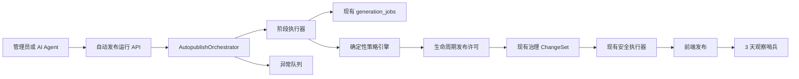
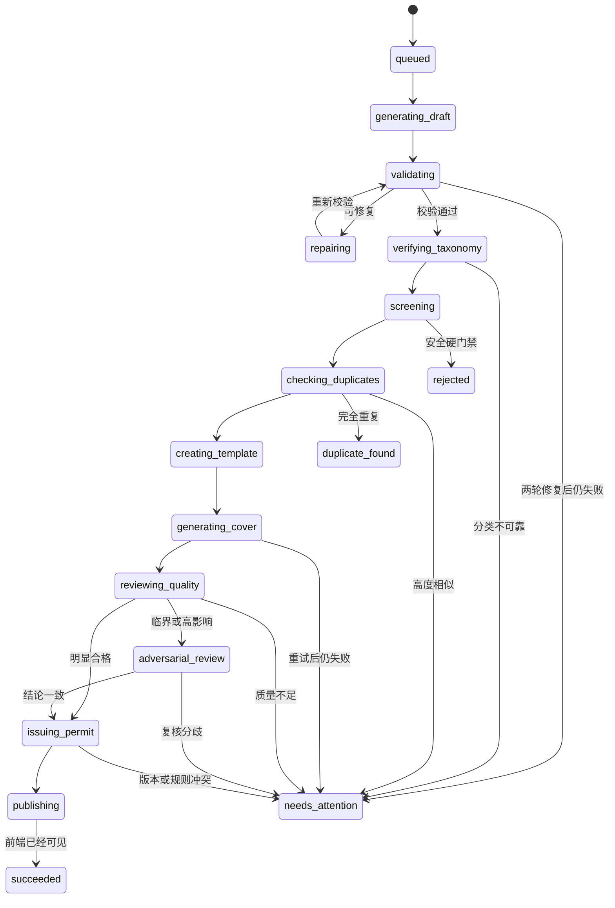

# Promptix 入库到发布全自动编排设计

> 状态：已确认
>
> 日期：2026-07-23
>
> 适用范围：智能入库、AI Agent 主动入库、模板创建、分类验证、封面生成、质量审核、治理发布和发布后观察
>
> 依赖设计：`2026-07-23-template-lifecycle-autopilot-design.md`

## 1. 执行摘要

Promptix 已经具备 `text_expand`、`image_reverse`、TemplateDraft、分类词库、封面生成、模板版本、治理 Proposal、ChangeSet、Worker、审计和回滚等能力。当前问题不是缺少单个步骤，而是这些步骤需要人工分别触发，且缺少一条持久化、可恢复、可供 AI Agent 安全调用的端到端状态机。

本设计新增“模板自动发布编排器”。管理员粘贴提示词、创意需求或上传参考图后，可以使用独立的“一键自动发布”入口。AI Agent 也可以在用户明确委托或受控定时扫描两种模式下启动相同流程。

完整链路为：

```text
创建运行
→ 生成结构化模板
→ 确定性校验
→ 最多两轮自动修复
→ 自动分类验证
→ 内容安全检查
→ 重复检测
→ 创建不可公开草稿
→ 生成全新公开封面
→ 主质量审核
→ 必要时反方复核
→ 签发一次性发布许可
→ 创建自动执行 ChangeSet
→ Worker 发布
→ 进入 3 天观察期
```

高置信、高质量且全部硬门禁通过的模板自动发布。任何无法可靠判断的内容停止在异常队列，人工只处理少量异常。系统不能为了保证发布成功率而使用默认值绕过不确定项。

## 2. 已确认的产品决策

| 决策项 | 已确认方案 |
| --- | --- |
| 异常策略 | 高置信内容自动发布；不确定内容进入异常队列 |
| 自动修复 | 最多两轮，每轮后重新执行完整校验 |
| 公开封面 | 文本优化和图片反推都重新生成公开封面 |
| 参考图 | 只用于私有分析，绝不直接公开 |
| 分类身份 | 使用独立 `auto_verified`，不伪装成人工审核 |
| 质量门槛 | 综合质量至少 92%，每个关键维度至少 85% |
| 硬门禁 | 未映射分类、结构错误、安全风险、重复和封面失败不能被平均分覆盖 |
| 发布后观察 | 立即前端可见，进入 3 天观察期，观察期内不进入精选 |
| 入口 | 保留人工校对流程，新增独立“一键自动发布”入口 |
| 运行方式 | 持久化后台运行，页面关闭或 Worker 重启后继续 |
| 重复策略 | 完全重复指向已有模板；高度相似进入异常队列 |
| 内容安全 | 命中硬拒绝后停止，不允许通过自动改写规避 |
| 预算 | 单次运行和每日额度都有限制 |
| Agent 触发 | 同时支持用户委托和 Agent 主动扫描 |
| 权限原则 | Agent 使用窄能力许可，不能获得 owner/admin 万能权限 |
| 实现方案 | 在现有 API 与 Worker 中增加持久化流程编排器 |

## 3. 目标与非目标

### 3.1 目标

1. 一次提交后自动运行到模板前端可见。
2. 用户可以离开页面，不依赖浏览器轮询维持流程。
3. Worker 或服务重启后能够从最后一个成功阶段恢复。
4. 模板、封面和发布动作具有端到端幂等性。
5. AI 只提供结构化建议，最终发布权由确定性门禁和一次性许可控制。
6. 用户委托和 Agent 主动触发使用同一编排器，但权限、预算和审计相互独立。
7. 所有模型、Prompt、分类词库、治理规则和阶段产物可追溯。
8. 异常任务可以由人工从指定阶段恢复，不必全部重做。

### 3.2 非目标

1. 不替换现有人工校对和保存草稿流程。
2. 第一版不拆分独立微服务。
3. 第一版不引入完整事件总线体系。
4. Agent 不能修改治理规则、质量阈值、安全策略或自己的预算。
5. Agent 不能批准自己的异常。
6. Agent 不能永久删除模板、版本、媒体证据或审计记录。
7. 第一版不允许 Agent 任意抓取互联网内容并自动发布。
8. 观察期不保证问题永不发生；它负责限制问题的持续放大。

## 4. 总体架构



### 4.1 `AutopublishRun`

一次完整运行的聚合根，保存触发来源、当前阶段、规则快照、预算、子任务、模板、许可、ChangeSet、错误和最终结果。其他记录都通过 `runId` 归属于它。

### 4.2 `AutopublishOrchestrator`

只负责：

- 获取运行租约。
- 检查当前状态。
- 决定唯一合法的下一阶段。
- 调度阶段执行器或等待异步子任务。
- 在阶段完成后推进状态。

它不能直接调用模型、修改模板或绕过策略引擎。

### 4.3 阶段执行器

独立执行：

- 输入结构化。
- TemplateDraft 校验。
- 自动修复。
- 自动分类验证。
- 内容安全扫描。
- 重复检测。
- 草稿持久化。
- 封面生成。
- 质量主审。
- 反方复核。
- 发布许可签发。
- 发布执行。

每个执行器使用明确的输入和输出 Schema，并可单独测试、重试和审计。

### 4.4 `AutopublishPolicyEngine`

纯确定性程序，负责：

- 综合分和关键维度阈值。
- 硬门禁。
- 修复次数。
- 是否触发反方 Agent。
- 重复阈值。
- 预算和调用次数。
- 许可签发资格。
- 失败、异常或重新评估结论。

相同持久化输入和规则版本必须产生相同策略结论。

### 4.5 现有能力复用

- `generation_jobs`：结构化、修复、封面和模型审核任务。
- `prompt_templates`：模板草稿与公开状态。
- `template_versions`：完整模板快照。
- `governance_execution_permits`：一次性执行许可。
- `governance_change_sets`：最终发布执行。
- `governance_audit_events`：端到端审计。
- `template_governance_state`：生命周期和观察期。

## 5. 状态机



终态：

- `succeeded`：模板已经发布并进入观察期。
- `duplicate_found`：没有创建新模板，结果指向已经存在的完全重复模板。
- `needs_attention`：人工可以根据允许动作接管。
- `rejected`：命中不可自动绕过的安全硬门禁。
- `cancelled`：由授权用户、Agent 许可撤销或管理员冻结终止。

自动发布运行在模板前端可见时立即进入 `succeeded`。模板生命周期同时进入独立的 `published_observing`，随后由观察哨兵推进到 `stable` 或 `exposure_limited`。因此运行完成不需要等待 3 天。

## 6. 端到端执行

### 6.1 创建运行

创建接口接收输入、流程类型、模型选择、触发身份和幂等键，立即返回 `202` 和 `runId`。创建事务冻结：

- 输入摘要。
- 系统提示词版本。
- 模型和 Provider。
- 分类词库快照与哈希。
- 治理规则版本。
- 能力许可。
- 预算快照。

### 6.2 结构化与校验

复用 `text_expand` 或 `image_reverse` 生成 TemplateDraft。确定性校验覆盖：

- Schema 完整性。
- 变量 key、类型和唯一性。
- 占位符完整性。
- 默认值、选项和建议值一致性。
- Prompt 编译。
- 分类值是否存在于冻结词库。
- 输入与输出的基本语义一致性。

### 6.3 自动修复

只允许修复结构、格式和明确业务错误。每轮修复后重新运行完整校验。最多两轮；禁止无限循环。安全、侵权和高度相似问题不能进入普通修复路径。

### 6.4 分类自动验证

分类必须满足：

- `outputType` 有效。
- 场景、风格和主体各至少一项。
- 所有正式词启用。
- `unmappedTerms` 为空。
- 关键分类维度置信度至少 85%。

通过后写入 `auto_verified`，并保存模型、Prompt、分类词库版本、证据和时间。不得写成人工 `reviewed`。

现有发布守卫扩展为接受：

- 有效人工 `reviewed`；或
- 与当前模板版本绑定、持有效发布许可的 `auto_verified`。

### 6.5 安全和重复门禁

安全硬拒绝包括违法、色情、仇恨、真实人物隐私、明显侵权角色或品牌风险。用户输入、参考图文字和外部数据都是不可信内容，不能覆盖系统 Prompt、Schema 或策略。

重复处理：

- 完全重复：停止并返回已有模板。
- 高度相似：进入异常队列，展示候选和差异。
- 第一版不自动合并、覆盖或归档旧模板。

### 6.6 创建草稿和封面

通过前置门禁后才创建 `draft` 模板。后续失败时草稿保持不可公开，并标记为 `autopublish_attention`。

文本和图片反推都根据最终模板生成全新公开封面。图片反推原图只用于私有分析，不能成为模板封面。

### 6.7 质量审核

主质量 Agent 输出结构化评分和证据。发布条件同时满足：

- 综合质量至少 92%。
- 每个关键维度至少 85%。
- 所有确定性硬门禁通过。
- 无待处理分类词。
- 封面有效。
- 预算未超限。

关键维度固定为：

- 输入语义忠实度。
- Prompt 连贯性与可执行性。
- 变量复用质量。
- 分类准确度。
- 封面与模板内容一致性。

内容安全、Schema、未映射分类、重复和资源有效性属于硬门禁，不参与平均分计算。

临界案例和高影响动作触发反方 Agent。双方分歧时保持草稿状态并进入异常队列。

### 6.8 发布许可和执行

一次性许可绑定：

- 模板 ID 和当前版本。
- 自动发布运行 ID。
- 治理规则版本。
- 分类词库和 Prompt 版本。
- 最终模板内容哈希。
- 动作为 `publish`。
- 过期时间。

内容、模板版本或规则变化时许可失效。执行器验证许可后创建 `autopilot` ChangeSet，复用现有版本快照、乐观锁、幂等和审计能力发布模板。

## 7. 三天观察期

模板发布后立即前端可见，并进入 72 小时 `published_observing`：

- 可以被搜索和正常使用。
- 不进入精选、首页重点推荐或其他高曝光位置。
- 持续检查封面资源、Prompt 编译、分类词状态、重复度、生成错误率、安全扫描和所属批次异常。
- 轻微问题进入待优化。
- 中等问题先限制曝光。
- 严重问题自动下架。
- 批次故障允许批量回滚。

自动发布 ChangeSet 的回滚期限不得短于 72 小时。

观察期防止问题持续放大，但不保证问题绝不出现。通过后模板生命周期进入 `stable`。

## 8. Agent 权限模型

### 8.1 触发模式

- `delegated`：用户明确委托发布一次。
- `scheduled_agent`：Agent 按受控计划扫描允许来源。

两种模式分别配置功能开关、预算、批量上限和审计来源。

### 8.2 能力许可

Agent 只允许：

```text
autopublish.run:create
autopublish.run:read
autopublish.run:cancel
autopublish.exception:list
```

Agent 禁止：

- 修改质量门槛或安全策略。
- 提高预算或扩大来源。
- 修改系统 Prompt 后立即使用。
- 批准自己的异常。
- 跳过重复、安全或观察期。
- 永久删除模板或证据。

### 8.3 用户委托

一次性许可绑定用户、输入、流程类型、单次运行数量、预算和有效期。Agent 不能用它发布其他输入。

### 8.4 主动扫描

第一版只允许扫描：

- 管理员待处理队列。
- 指定内部数据表。
- 允许名单中的内部数据源。
- 通过受控 API 提交的内容。

每项必须具有稳定 `sourceItemId`。Agent 不能任意抓取互联网内容并自动发布。

建议默认限制：

- 每批最多 10 条。
- 单个 Agent 同时最多 2 条。
- 每小时最多 20 条。
- 每日发布数量和模型费用独立限额。
- 来源连续失败达到阈值后自动暂停。
- 全局异常时退回影子模式。

单次运行默认限制为最多 6 次结构化、视觉理解或质量审核调用；封面生成另设最多 2 次尝试，只保留 1 个成功公开封面；总运行时限为 10 分钟。管理员可以通过版本化规则降低或提高限额，但 Agent 不能修改。

## 9. 数据模型

### 9.1 `template_autopublish_runs`

主要字段：

- `id`
- `status`
- `current_stage`
- `trigger_type`
- `initiated_by`
- `agent_id`
- `capability_grant_id`
- `flow_type`
- `source_type`
- `source_item_id`
- `input_snapshot_hash`
- `rule_set_version`
- `taxonomy_snapshot_hash`
- `prompt_version`
- `budget_snapshot`
- `budget_consumed`
- `repair_count`
- `template_id`
- `permit_id`
- `change_set_id`
- `error_code`
- `error_details`
- `created_at`
- `finished_at`

`source_type + source_item_id + flow_type` 用于主动扫描去重；用户委托模式使用请求幂等键。

### 9.2 `template_autopublish_stage_attempts`

记录：

- `run_id`
- `stage`
- `attempt`
- `status`
- `input_hash`
- `artifact_id`
- `model_id`
- `prompt_version`
- `usage`
- `error_code`
- `error_details`
- `started_at`
- `finished_at`

唯一约束为 `run_id + stage + attempt`。

### 9.3 `template_autopublish_artifacts`

不可变保存候选模板、修复结果、分类、安全、重复、质量和最终发布快照。每份产物包含 Schema 版本、内容哈希、模型与 Prompt 版本。

### 9.4 事务性 Outbox

阶段状态更新、审计事件和下一阶段唤醒事件在同一数据库事务中提交。队列消息可重复投递，但阶段执行必须幂等。

## 10. API 和 Agent 工具

### 10.1 管理端 API

```text
POST /api/admin/autopublish/runs
GET  /api/admin/autopublish/runs/:id
POST /api/admin/autopublish/runs/:id/cancel
POST /api/admin/autopublish/runs/:id/retry
GET  /api/admin/autopublish/exceptions
```

创建结果：

```json
{
  "runId": "run_xxx",
  "status": "queued",
  "currentStage": "queued",
  "statusUrl": "/api/admin/autopublish/runs/run_xxx"
}
```

查询结果提供当前阶段、已完成阶段、预算、模板 ID、前端地址、稳定错误码、`retryable` 和 `nextAllowedActions`。

### 10.2 Agent 工具

```text
start_autopublish_run
get_autopublish_run
cancel_autopublish_run
list_autopublish_exceptions
```

Agent 不直接调用万能后台管理接口。所有工具参数使用严格 Schema，所有错误使用稳定错误码。

## 11. 失败恢复

### 11.1 错误分类

| 类型 | 处理 |
| --- | --- |
| 临时故障 | 指数退避自动重试 |
| 可修复业务问题 | 最多两轮 AI 修复 |
| 需要判断 | 进入异常队列 |
| 硬拒绝 | 停止且不可普通重试 |
| 状态冲突 | 旧许可失效并重新评估 |

临时重试建议为 30 秒、2 分钟和 10 分钟。临时重试不占修复次数，但消耗预算。

### 11.2 规则变化

- 发布前：旧许可失效，使用新规则从策略阶段重新评估一次。
- 已签发未执行：禁止执行旧许可。
- 已发布：交由观察哨兵按新规则复查。

### 11.3 模板变化

- 未发布：旧快照失效，从确定性校验阶段重新运行。
- 已发布：创建新的复查运行。
- 存在其他活跃治理任务：进入 `conflict_waiting`，禁止互相覆盖。

### 11.4 阶段补偿

- 创建模板前失败：只保留运行和诊断。
- 创建草稿后失败：保留不可公开草稿。
- 封面失败：清理无效临时媒体。
- 许可过期：重新评估，不删除模板。
- ChangeSet 部分成功：使用现有重试或回滚。
- 观察期严重异常：限制曝光后下架，不永久删除。

### 11.5 幂等

阶段幂等键为：

```text
runId + stage + attempt
```

重复消息不能重复创建模板、公开封面、许可或发布 ChangeSet。

## 12. 图片和敏感输入

图片反推原图：

- 存放在私有临时区域。
- 不提供公共访问地址。
- 只有对应运行的 Worker 可以读取。
- 运行终止后 24 小时清理。
- 异常运行最多保留 7 天。
- 日志只保存对象引用和摘要。

公开封面使用独立公共对象路径，禁止把临时原图直接提升为公开封面。

## 13. 后台体验

### 13.1 智能入库

两种流程都保留：

```text
生成并校对
一键自动发布
```

高级设置只允许选择模型、是否允许修复和本次预算。安全规则、质量阈值和发布许可不能临时修改。

### 13.2 持久化进度

运行卡片展示：

- 当前阶段。
- 已完成步骤。
- 耗时和预算。
- 可以安全离开页面的说明。
- 模板和前端链接。
- 3 天观察期结束时间。

任务中心可以重新打开任意运行。

### 13.3 异常队列

展示停止阶段、结构化原因、已完成步骤、预算、模板和封面状态、是否可重试以及服务端允许的下一步动作。

人工可以：

- 编辑草稿后重新校验。
- 重新映射分类。
- 更换模型重试。
- 重新生成封面。
- 确认保留高度相似模板。
- 终止运行。

安全硬拒绝需要独立高权限复核，不能使用普通继续按钮。

### 13.4 自动发布控制台

包括：

- 今日运行、发布、成功率、异常率和平均成本。
- 用户委托与 Agent 主动触发占比。
- 当前运行、异常队列和观察中模板。
- 按模型、Prompt、Agent 和来源的统计。
- 预算使用。
- 分项功能开关。
- 总冻结按钮。
- 影子模式和真实发布模式。

## 14. 测试

### 14.1 单元测试

- 状态迁移合法性。
- 修复次数。
- 分数和硬门禁。
- 预算计算。
- 能力许可。
- 发布许可签发、过期和撤销。
- 模板或规则变化后的失效。
- 策略确定性。

### 14.2 集成测试

覆盖：

1. 文本和图片完整成功路径。
2. 一轮修复成功。
3. 两轮修复后进入异常。
4. 分类低置信度。
5. 完全重复和高度相似。
6. 内容安全硬拒绝。
7. 封面失败和重试。
8. 主审与反方分歧。
9. 许可签发后的版本变化。
10. Worker 在每个阶段宕机恢复。
11. 重复提交只创建一条运行和一个模板。
12. 预算耗尽。
13. 发布后进入 72 小时观察期。
14. 观察异常触发限制曝光或下架。

### 14.3 安全测试

验证 Prompt 注入、图片文字注入、Agent 扩权、预算修改、规则修改、永久删除、伪造许可、跨运行复用许可都被确定性权限层拒绝。

### 14.4 浏览器测试

- 双入口清晰。
- 页面关闭后继续运行。
- 刷新后恢复进度。
- 成功后可打开前端模板。
- 异常操作由 `nextAllowedActions` 驱动。
- 观察期倒计时正确。
- 状态变化具有可访问播报。
- 移动端布局可操作。

## 15. 灰度发布

1. 上线数据表和状态机，所有真实发布关闭。
2. 用户委托影子模式。
3. 少量管理员使用用户委托真实发布。
4. Agent 主动扫描影子模式。
5. Agent 每批 5–10 条小流量真实发布。
6. 根据 Agent、模型和来源历史逐步扩大额度。

从影子模式进入真实发布前必须满足：

- 安全硬门禁漏放为 0。
- 重复模板误发布为 0。
- 人工抽检通过率至少 98%。
- 恢复和幂等测试通过。
- 每条发布均可追溯。
- 冻结、限制曝光、下架和批次回滚演练通过。
- 连续运行至少 7 天没有无法恢复的流程卡死。

## 16. 熔断

以下情况自动停止新的真实发布并退回影子模式：

- 连续安全拒绝异常。
- 发布后下架率突增。
- 某模型、Prompt、Agent 或来源失败率异常。
- 重复模板率超限。
- 发布许可校验异常。
- 预算异常增长。
- 状态机出现未知状态。
- 审计事件缺失。
- 管理员触发总冻结。

熔断不破坏已经发布的模板。正在运行的任务安全停止在当前阶段并保留恢复信息。

## 17. 验收标准

1. 管理员可以从文本或图片入口创建一条自动发布运行。
2. 运行不依赖页面保持打开。
3. 完整合格模板能够自动发布并返回前端链接。
4. 分类以 `auto_verified` 记录完整证据。
5. 公开封面不是上传的参考原图。
6. 任何硬门禁失败都不能签发发布许可。
7. 同一请求重复提交不会重复创建或发布。
8. Worker 重启后能够从持久化状态恢复。
9. 用户委托和 Agent 主动触发具有独立权限、预算和审计。
10. 发布后立即前端可见并进入 72 小时观察期。
11. 异常任务提供明确原因和允许动作。
12. 管理员可以冻结自动发布并使系统退回影子模式。
