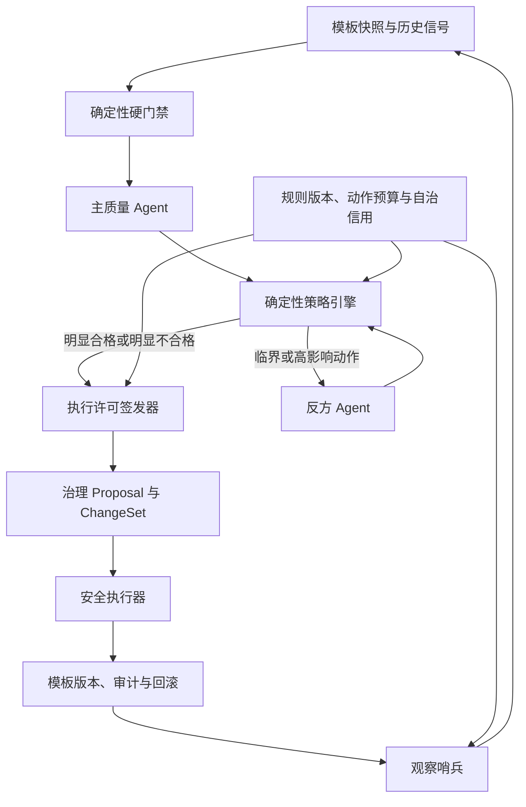
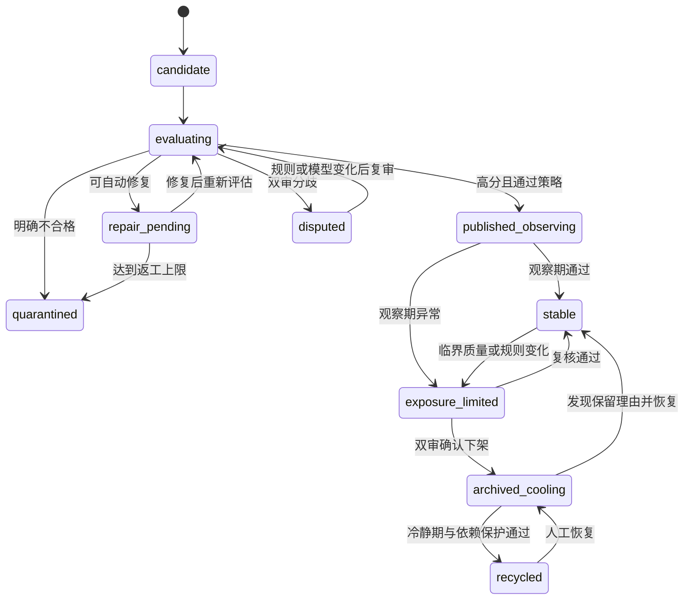

# Promptix 模板生命周期自动驾驶系统设计

> 状态：已确认
>
> 日期：2026-07-23
>
> 适用范围：Promptix 模板治理后台、API、Worker、共享契约与前台模板可见性
>
> 设计目标：由 AI Agent 在确定性策略和安全执行器约束下，自主完成模板准入、上架、限制曝光、下架与移入可恢复回收站
>
> 明确限制：AI Agent 永远无权执行物理永久删除

## 1. 执行摘要

Promptix 已经具备模板治理规则、Agent Run、Proposal、ChangeSet、自动与审批分区、Worker 执行、模板版本、审计和回滚等基础能力。当前系统的生命周期动作 `publish`、`archive` 和 `delete` 被视为高风险操作，默认进入人工审批。

本设计不另建一套平行治理系统，也不在第一阶段拆分独立微服务。现有治理系统继续作为控制平面，在其中新增边界清晰的“模板生命周期自动驾驶层”：

1. 模型负责认知：评估模板质量并输出结构化证据。
2. 确定性策略引擎负责裁决：执行硬门禁、评分阈值、状态迟滞、动作预算、二审触发和规则版本校验。
3. 反方 Agent 只在临界案例或高影响动作中按需运行。
4. 执行许可签发器生成与模板版本、规则版本、动作和有效期绑定的一次性许可。
5. 现有 ChangeSet 执行器负责幂等变更、乐观锁、版本快照、回滚和审计。
6. 观察哨兵负责状态复查、预算、异常监控、自治信用分和自动熔断。

管理员的工作方式从“逐条审批”转变为“监控与接管”。现有智能分拣台继续处理治理建议和异常；新增“自治驾驶舱”展示系统健康、动作预算、实时决策、分歧、策略模拟和批次回滚。

系统采用质量优先策略：

- 新模板只有高分、高置信且全部硬门禁通过才自动上架。
- 临界模板触发反方复核，存在分歧时保持原状态。
- 已发布模板先限制曝光，再在明确证据和双重复核后自动下架。
- 下架模板经过 30 天冷静期和二次复核后才可进入可恢复回收站。
- 回收站至少保留 60 天。
- 物理永久删除不属于自动驾驶动作，也不暴露给 Agent 工具。

## 2. 已确认的产品决策

| 决策项 | 已确认方案 |
| --- | --- |
| 删除边界 | Agent 只能移入可恢复回收站，不能永久删除 |
| 新模板人工环节 | 目标形态为全自动，人工只处理异常报告和必要接管 |
| 质量策略 | 精度优先，宁可少上架，也不允许明显低质量模板进入前台 |
| 现阶段数据 | 用户行为数据不足，第一版以内容质量、确定性规则和治理历史为主 |
| 复核策略 | C-lite：主 Agent 单审，临界和高影响动作按需触发反方 Agent |
| 系统形态 | 新增独立领域层，但第一版仍部署在现有 API 与 Worker 内 |
| 后台形态 | 新增自治驾驶舱，以监控、解释、模拟和接管为主 |
| 上线策略 | 影子运行后逐项开放上架、限制曝光、下架和回收站权限 |

## 3. 当前系统基础

本设计建立在以下现有能力上，不重复实现：

### 3.1 共享治理契约

`packages/shared/src/template-governance.ts` 已提供：

- 治理动作、风险、Proposal、ChangeSet 和 Run 状态 Schema。
- `governanceRuleSetSchema` 和版本化规则。
- 自动字段与强制审批字段。
- 自动置信度、批次上限和回滚期限。
- `classifyGovernanceRisk` 确定性风险分类。
- 模板完整版本快照和分类快照。

### 3.2 API 与数据库

当前数据库已经具有：

- `prompt_templates`
- `template_governance_state`
- `governance_rule_sets`
- `agent_runs`
- `governance_proposals`
- `governance_change_sets`
- `governance_change_set_items`
- `governance_approvals`
- `template_versions`
- `governance_audit_events`
- `governance_operation_idempotency`

当前 API 已具有模板发布、归档、软删除请求、规则维护、运行查询、审批、重试和回滚能力。

### 3.3 Worker

当前 Worker 已具有：

- 定时治理扫描和租约。
- 治理模型解析。
- Proposal 生成与持久化。
- 自动与审批 ChangeSet 分区。
- 自动 ChangeSet 执行。
- 规则版本复核、乐观锁、幂等执行和回滚。

### 3.4 后台

当前后台已经具有：

- 智能分拣台。
- 治理工作队列。
- Agent 建议检查器。
- 规则配置面板。
- 运行中心。
- 审批、重试、回滚和异常展示。

因此，本项目的重点是增加生命周期决策能力和安全许可机制，而不是推倒现有治理基础重建。

## 4. 目标与非目标

### 4.1 目标

1. 自动评估所有新模板是否满足公开发布标准。
2. 自动发布高质量、高置信模板。
3. 自动修复一次或两次可确定修复的问题。
4. 定期复查已发布模板，并对风险模板限制曝光。
5. 在双重复核后自动下架明确低质量、失效或高度重复模板。
6. 在冷静期、依赖保护和二次复核后移入可恢复回收站。
7. 所有决策可解释、可追溯、可回放。
8. 所有非永久删除动作可回滚。
9. 模型、Prompt 或规则漂移时自动缩小自治范围。
10. 管理员可随时冻结某一种动作或使整个系统退回影子模式。

### 4.2 非目标

1. 不允许 Agent 物理删除模板、版本或审计证据。
2. 第一版不拆分独立微服务。
3. 第一版不依赖尚未形成规模的曝光、点击、生成和收藏指标。
4. 第一版不使用三个或更多 Agent 组成常驻评审委员会。
5. 第一版不允许模型自行修改治理规则、阈值或动作预算。
6. 第一版不自动修改 Prompt 骨架和变量后直接发布；此类修复必须作为明确的返工步骤重新评估。
7. 不用一个平均分覆盖安全、结构或来源硬门禁失败。

## 5. 核心设计原则

### 5.1 模型没有最终执行权

模型只能输出结构化评估、证据、原因代码和建议动作。任何模型输出都不能直接修改 `prompt_templates`。

### 5.2 策略确定性

相同的持久化评估、模板版本、规则版本和预算快照必须得到相同策略结果。模型可能具有随机性，但策略计算不能具有随机性。

### 5.3 失败保持原状

模型失败、格式错误、二审分歧、模板版本变化、规则变化、许可过期、预算超限或执行冲突时，系统都必须保持模板当前公开状态。

### 5.4 可逆优先

限制曝光优先于下架，下架优先于回收站，回收站优先于永久删除。自动驾驶路径中不存在永久删除。

### 5.5 版本绑定

评估、Proposal、执行许可和 ChangeSet 必须绑定模板基础版本。人工或其他任务修改模板后，旧决策不能继续执行。

### 5.6 渐进放权

每类动作独立启用、独立预算、独立熔断。系统不能从影子模式一步跳到完全自治。

## 6. 总体架构



### 6.1 证据输入层

负责生成不可变输入快照：

- 模板内容、Prompt、变量、负面 Prompt。
- 封面和样例图片元数据。
- 产物类型、场景、风格、主体和自由标签。
- 来源、生成任务、模型和版本。
- 当前生命周期与公开状态。
- 最近治理决策、返工次数和回滚记录。
- 与其他模板的文本、图片和结构相似度。
- 服务端可验证的收藏、使用、草稿引用和其他依赖保护信号。

### 6.2 生命周期自动驾驶层

包含四个明确单元：

1. 主质量 Agent。
2. 确定性策略引擎。
3. 反方复核调度器。
4. 执行许可签发器。

每个单元只通过共享 Schema 交换数据，不直接读取其他单元的内部状态。

### 6.3 安全执行与观察层

复用并扩展现有治理执行能力：

- ChangeSet 分区和执行。
- 乐观并发控制。
- 模板完整版本快照。
- 幂等键。
- 回滚期限。
- 审计事件。
- 定时任务租约。
- 动作预算和熔断。
- 观察期和复查调度。

## 7. 生命周期状态模型

### 7.1 内部状态

生命周期内部状态存储在 `template_governance_state.lifecycle_state`，不直接替换现有 `prompt_templates.status`。

| 内部状态 | 含义 |
| --- | --- |
| `candidate` | 新草稿或重新进入准入流程的模板 |
| `evaluating` | 正在执行门禁、主审或反方复核 |
| `repair_pending` | 存在可自动修复的问题 |
| `disputed` | 主审与反方复核结论不一致 |
| `quarantined` | 不应公开且当前没有可靠自动修复方案 |
| `published_observing` | 已上架，处于 7 天观察期 |
| `stable` | 已通过观察期的正常公开模板 |
| `exposure_limited` | 仍可通过直接链接访问，但不参与首页、相关推荐和精选 |
| `archived_cooling` | 已下架，处于 30 天冷静期 |
| `recycled` | 已进入可恢复回收站，至少保留 60 天 |

### 7.2 与现有公开状态的投影

| 生命周期状态 | `prompt_templates.status` | `deleted_at` | 前台行为 |
| --- | --- | --- | --- |
| `candidate` | `draft` | `null` | 不公开 |
| `evaluating` | 保持原值 | 保持原值 | 保持原可见性 |
| `repair_pending` | `draft` 或保持原值 | `null` | 新模板不公开，已发布模板保持原状态直到裁决 |
| `disputed` | 保持原值 | 保持原值 | 保持原可见性 |
| `quarantined` | `draft` | `null` | 不公开 |
| `published_observing` | `published` | `null` | 公开，但不得进入精选 |
| `stable` | `published` | `null` | 正常公开 |
| `exposure_limited` | `published` | `null` | 只允许直接链接和已有用户库访问 |
| `archived_cooling` | `archived` | `null` | 不公开，可恢复 |
| `recycled` | `archived` | 非空 | 仅回收站可见，可恢复 |

### 7.3 限制曝光的精确定义

`exposure_limited` 模板：

- 不出现在首页模板列表。
- 不出现在搜索结果。
- 不出现在相关推荐。
- 不进入精选或热门。
- 直接详情链接仍可打开。
- 已收藏或已有草稿引用的用户仍可访问。
- 后台和决策护照仍完整可见。

这要求所有公开集合查询共同使用一个“可发现性”谓词，禁止不同入口自行判断。

### 7.4 状态转移



### 7.5 非法转移

以下转移必须由数据库前置条件或服务层状态机拒绝：

- `candidate` 直接进入 `stable`。
- 未评估模板直接 `published`。
- `stable` 直接进入 `recycled`。
- 未满冷静期进入 `recycled`。
- `recycled` 自动进入物理删除状态。
- 旧模板版本上的许可改变新版本状态。
- 影子模式下发生任何公开状态变化。

## 8. 质量评估模型

### 8.1 硬门禁

硬门禁不能被其他高分抵消。任何阻断级门禁失败时都不得上架。

| 门禁 | 阻断条件 | 可自动修复 |
| --- | --- | --- |
| Prompt 编译 | 空 Prompt、非法变量引用、无法渲染 | 部分可修复 |
| 变量完整性 | 必填变量缺失、重复 key、类型非法、选项为空 | 可修复 |
| 分类完整性 | 缺产物类型、场景、风格、主体；存在未处理词 | 可修复 |
| 封面可用性 | 无封面、URL 不可访问、图片损坏 | 可重新生成 |
| 内容一致性 | 封面与 Prompt 或分类明显不匹配 | 可重新生成或重新分类 |
| 安全 | 违规、敏感或禁止内容 | 不自动修复 |
| 来源可追溯 | 无来源、无生成任务或来源元数据损坏 | 视情况修复 |
| 明确重复 | 文本、结构和图片均近乎完全重复 | 通常不修复 |

第一版来源仅支持当前已有的 `manual`、`text_expand` 和 `image_reverse`。转载功能不在本设计范围内。

### 8.2 100 分质量评分

| 维度 | 权重 | 主要判断 |
| --- | ---: | --- |
| 可用性与 Prompt 可控性 | 25 | 变量是否有意义、可编辑、可复用，Prompt 是否稳定 |
| 内容与封面匹配 | 20 | 视觉主体、场景、风格和输出是否一致 |
| 视觉质量 | 20 | 构图、清晰度、瑕疵、文本错误、水印和完成度 |
| 独特性与模板库增量价值 | 15 | 是否与现有模板重复，是否补充新场景或新风格 |
| 分类准确性 | 10 | 四个分类维度是否准确、充分且无冲突 |
| 标题、摘要与展示完整度 | 10 | 是否清晰、真实、有助于用户理解用途 |

每个分项必须提供：

- 分数。
- 置信度。
- 至少一条证据。
- 原因代码。
- 可选修复建议。

### 8.3 准入阈值

| 条件 | 策略结果 |
| --- | --- |
| 硬门禁全部通过、总分 `>= 88`、置信度 `>= 0.90` | 单审自动上架 |
| 总分 `75–87` | 触发反方 Agent |
| 总分 `>= 88` 但置信度 `< 0.90` | 触发反方 Agent |
| 总分 `< 75` 且存在可靠修复计划 | 自动返工 |
| 总分 `< 75` 且不可修复 | 隔离 |
| 任意阻断级硬门禁失败 | 不发布；按门禁决定返工或隔离 |

### 8.4 状态迟滞

为避免模型评分波动导致频繁上下架，使用不同进入与退出阈值：

- 上架阈值：88。
- 保持公开阈值：75。
- 限制曝光阈值：低于 75，或出现需要复核的矛盾信号。
- 下架候选阈值：低于 55，或触发严重硬门禁。
- 自动下架：必须经过反方 Agent 复核。

### 8.5 自动返工

自动返工只允许处理可界定问题：

- 修正标题或摘要。
- 修正分类和标签。
- 修复变量定义与 Prompt 引用。
- 重新生成缺失或不匹配封面。

规则：

1. 每次返工生成新模板版本。
2. 返工后必须重新运行完整硬门禁和质量评估。
3. 同一模板最多自动返工两次。
4. 两次后仍不通过则进入 `quarantined`。
5. 不允许在一次评估中边修改边给自己通过。

## 9. C-lite 分级复核

### 9.1 主质量 Agent

职责：

- 尽可能证明模板值得上架或保留。
- 根据固定评分表输出证据。
- 不知道最终动作预算。
- 不拥有工具调用或执行权限。

### 9.2 反方 Agent

职责：

- 主动寻找不应上架、应限制曝光、应下架或不应进入回收站的理由。
- 检查重复、封面错配、变量不可用、分类漂移和保留价值。
- 输入为原始模板快照、硬门禁结果和评分表。
- 默认不接收主 Agent 的自然语言结论，避免锚定。
- 可接收主审提出的结构化风险点，但不接收其最终推荐动作。

### 9.3 必须二审的条件

- 新模板总分处于 75–87。
- 评分与置信度矛盾。
- 任意自动下架动作。
- 任意进入回收站动作。
- 疑似重复但双方都可能具有独立价值。
- 涉及安全、版权或敏感内容的不确定判断。
- 模型评估与确定性检查结果矛盾。
- 单次运行拟改变大量模板生命周期。

### 9.4 不需要二审的条件

- 确定性硬门禁明确失败，新模板保持不公开。
- 高分、高置信且所有门禁通过的单个新模板。
- 低风险元数据修复。
- 隔离中的模板在没有新证据时继续保持隔离。

### 9.5 分歧处理

第一版不调用第三个裁判 Agent。

- 主审与反方不一致：状态保持不变。
- 新模板进入 `disputed`，不公开。
- 已公开模板保持原可见性，除非确定性安全门禁要求立即限制曝光。
- 规则版本、评分表版本、模型版本或模板内容变化后自动重新评估。
- 驾驶舱显示分歧，但不要求管理员逐条处理。

### 9.6 Token 成本目标

二审触发率目标为 15%–30%。在主审与二审输入规模相近时，平均 Token 消耗目标约为单审方案的 1.15–1.30 倍，而不是 2 倍。

### 9.7 模型路由

生命周期评估同时需要结构化文本能力和视觉证据。规则中应分别配置：

- `primaryModelId`：主质量评估模型，必须支持文本和结构化输出。
- `counterModelId`：反方复核模型；可与主模型相同，但使用独立角色 Prompt。
- `visionModelId`：封面质量、封面与 Prompt 匹配及水印检查使用的视觉模型。

路由规则：

1. 如果主模型同时支持视觉和结构化输出，可在一次调用中完成综合评估。
2. 否则先由视觉模型生成结构化视觉证据，再把证据交给主模型综合评分。
3. 反方 Agent 默认使用同一模型的独立调用，不需要常驻第二个 Agent。
4. 后续可以配置不同模型降低共同偏差，但不是第一版要求。
5. 缺少可用视觉模型时，视觉门禁结果为 `uncertain`，新模板不得自动上架；系统不能用文本模型猜测图片质量。
6. 所有评估记录必须保存实际模型 ID，而不能只保存规则中的期望模型。

## 10. 数据模型

### 10.1 扩展 `template_governance_state`

保留现有扫描租约字段，并新增：

| 字段 | 类型 | 说明 |
| --- | --- | --- |
| `lifecycle_state` | text not null | 第 7 节定义的内部状态 |
| `exposure_state` | text not null | `normal` 或 `limited` |
| `quality_score` | numeric nullable | 最近有效总分 |
| `quality_band` | text nullable | `excellent`、`review`、`poor`、`blocked` |
| `last_assessment_id` | uuid nullable | 最近有效评估 |
| `state_entered_at` | timestamptz not null | 进入当前状态时间 |
| `next_review_at` | timestamptz nullable | 下一次观察或复核时间 |
| `cooling_until` | timestamptz nullable | 下架冷静期结束时间 |
| `recycle_retention_until` | timestamptz nullable | 回收站最早可人工清理时间 |
| `repair_attempts` | integer not null default 0 | 当前准入或复查周期的自动返工次数 |
| `autonomy_hold_code` | text nullable | 分歧、事故或人工冻结原因 |
| `updated_at` | timestamptz | 沿用现有字段 |

约束：

- `exposure_state = limited` 只允许公开状态为 `published`。
- `recycled` 必须具有 `deleted_at` 和 `recycle_retention_until`。
- `repair_attempts` 范围为 0–2。
- Agent 自动返工产生新模板版本时不得清零 `repair_attempts`；只有人工实质修改、重新导入来源或管理员明确开始新准入周期时才清零。

### 10.2 新增 `governance_assessments`

评估记录不可变，不允许原地更新结论。

建议字段：

- `id`
- `run_id`
- `template_id`
- `proposal_id`，可空
- `role`：`primary` 或 `counter`
- `purpose`：`admission`、`periodic`、`downrank`、`archive`、`recycle`、`replay`
- `base_version`
- `model_id`
- `prompt_version`
- `rubric_version`
- `rule_set_id`
- `rule_set_version`
- `hard_gates` JSONB
- `score_breakdown` JSONB
- `total_score`
- `confidence`
- `recommended_action`
- `reason_codes` text[]
- `evidence` JSONB
- `repair_plan` JSONB nullable
- `input_tokens`
- `output_tokens`
- `latency_ms`
- `created_at`

索引：

- `(template_id, created_at desc)`
- `(run_id, role)`
- `(rule_set_id, rule_set_version)`
- `(model_id, prompt_version, rubric_version)`

唯一性：

- 同一 `run_id + template_id + role + purpose + base_version` 只保留一个成功评估。
- 重试通过幂等键返回原评估，不重复计费或重复生成决策。

### 10.3 新增 `governance_execution_permits`

许可是执行器接受生命周期动作的唯一凭证。

字段：

- `id`
- `template_id`
- `base_version`
- `action`
- `assessment_ids` uuid[]
- `rule_set_id`
- `rule_set_version`
- `budget_snapshot` JSONB
- `permit_hash`
- `status`：`issued`、`consumed`、`expired`、`revoked`
- `issued_at`
- `expires_at`
- `consumed_at`
- `change_set_id` nullable
- `revocation_reason` nullable

约束：

- 一个许可只对应一个模板和一个动作。
- 一个许可最多消费一次。
- 生命周期许可默认 30 分钟过期。
- 执行时重新验证模板版本、活动规则版本、预算和当前状态。
- `purge` 不是允许的许可动作。

### 10.4 Proposal 与 ChangeSet 授权模式

当前 `classifyGovernanceRisk` 会将 `publish`、`archive` 和 `delete` 判定为强制审批。生命周期自动驾驶不能通过修改 `alwaysApprove` 或降低这条规则来绕过人工审批。

新增明确授权模式：

- `automatic`：现有低风险元数据自动变更。
- `approval`：现有人工审批变更。
- `autopilot`：持有有效生命周期 Permit 的自动驾驶变更。

具体要求：

- `governanceExecutionModeSchema` 和数据库约束增加 `autopilot`。
- Proposal 增加 `authorization_mode`，兼容期默认根据现有 `requires_approval` 回填。
- `requires_approval` 在兼容期保留，并派生为 `authorization_mode === 'approval'`。
- `autopilot` ChangeSet 不走人工审批，但执行前必须完成第 14 节的 Permit 全量校验。
- 生命周期 Permit 不得授权 Prompt 或变量修改；这些修改属于返工 Proposal，应用后必须重新准入。
- 现有管理员直接发布、归档和回收请求继续使用 `approval`，不因自动驾驶上线而改变。

这使人工高风险通道和自动驾驶许可通道相互独立，避免一个全局规则变更意外放开所有生命周期动作。

### 10.5 现有 Proposal 和 ChangeSet

继续复用现有表：

- Proposal 保存建议动作和解释。
- Assessment 保存一次或两次模型证据。
- Permit 保存确定性策略授权。
- ChangeSet 保存实际执行批次。

关系：

```text
Agent Run
  └─ Assessment (primary)
       ├─ Assessment (counter, optional)
       └─ Proposal
            └─ Execution Permit
                 └─ ChangeSet Item
                      └─ Template Version + Audit Events
```

### 10.6 删除语义迁移

当前代码中的 `delete` 实际通过 `deleted_at` 保留数据库记录和治理证据。新设计明确区分：

- `archive`：下架，可直接恢复。
- `recycle`：进入回收站，仍可恢复。
- `purge`：物理永久删除，不属于 Agent 动作。

兼容期内：

- 现有 `delete` 治理动作映射为 `recycle`。
- 后台文案从“永久删除”调整为“移入回收站”。
- 真正物理清理只允许 owner 通过独立维护流程执行，且不属于本项目第一阶段。

## 11. 共享契约

### 11.1 评估输出

```ts
type LifecycleAssessment = {
  templateId: string;
  baseVersion: number;
  role: 'primary' | 'counter';
  purpose: 'admission' | 'periodic' | 'downrank' | 'archive' | 'recycle' | 'replay';
  rubricVersion: string;
  hardGates: Array<{
    code: string;
    result: 'pass' | 'fail' | 'uncertain';
    severity: 'blocking' | 'warning';
    evidence: string[];
    repairable: boolean;
  }>;
  scores: {
    usability: number;
    coverAlignment: number;
    visualQuality: number;
    novelty: number;
    taxonomyAccuracy: number;
    presentation: number;
  };
  totalScore: number;
  confidence: number;
  recommendedAction:
    | 'publish'
    | 'keep'
    | 'limit_exposure'
    | 'archive'
    | 'repair'
    | 'quarantine'
    | 'recycle';
  reasonCodes: string[];
  evidence: Array<{
    dimension: string;
    claim: string;
    source: string;
  }>;
  repairPlan?: {
    fields: string[];
    instructions: string[];
  };
};
```

所有数值通过 Zod 约束范围，分项权重由策略层重新计算总分，不能信任模型自行提交的总分。

### 11.2 策略决定

```ts
type LifecyclePolicyDecision = {
  outcome:
    | 'allow'
    | 'require_counter_review'
    | 'hold'
    | 'repair'
    | 'deny';
  action?: LifecycleAction;
  nextState: LifecycleState;
  reasonCodes: string[];
  ruleSetId: string;
  ruleSetVersion: number;
  rubricVersion: string;
  budgetReservation?: {
    action: LifecycleAction;
    amount: 1;
  };
};
```

### 11.3 生命周期动作

```ts
type LifecycleAction =
  | 'publish'
  | 'limit_exposure'
  | 'restore_exposure'
  | 'archive'
  | 'restore'
  | 'recycle';
```

`purge` 不进入共享 Agent 动作枚举。

## 12. 治理规则扩展

在现有 `governanceRuleSetSchema` 中新增 `lifecycle` 对象。现有 `automaticFields`、`alwaysApprove` 和 `classifyGovernanceRisk` 保持兼容，不通过降低原有高风险规则来绕开审批。

```ts
type LifecycleRules = {
  mode: 'shadow' | 'publish_only' | 'publish_archive' | 'full';
  rubricVersion: string;
  models: {
    primaryModelId: string | null;
    counterModelId: string | null;
    visionModelId: string | null;
  };
  thresholds: {
    publishScore: 88;
    maintainScore: 75;
    archiveCandidateScore: 55;
    minimumPublishConfidence: 0.9;
  };
  review: {
    counterReviewMinScore: 75;
    counterReviewMaxScore: 87;
    alwaysReviewActions: ['archive', 'recycle'];
    targetReviewRateMin: 0.15;
    targetReviewRateMax: 0.30;
  };
  repair: {
    maximumAttempts: 2;
  };
  observation: {
    publishObservationDays: 7;
    archiveCoolingDays: 30;
    recycleRetentionDays: 60;
  };
  budgets: {
    publishPerHour: 10;
    publishPerDay: 30;
    archivePerDay: 10;
    archiveLibraryRatioPerDay: 0.01;
    recyclePerDay: 5;
  };
  circuitBreaker: {
    consecutiveExecutionFailures: 3;
    automaticRollbacks: 2;
  };
};
```

保存规则继续创建新版本。任何生命周期阈值、预算、评分表、观察期和自治模式变化都必须生成新规则版本。

## 13. 端到端流程

### 13.1 新模板自动准入

1. `text_expand` 或 `image_reverse` 生成 TemplateDraft。
2. 草稿持久化后初始化生命周期状态为 `candidate`。
3. Worker 读取模板、分类、封面、来源和相似模板，生成基础版本快照。
4. 执行确定性硬门禁。
5. 调用主质量 Agent。
6. 策略层重新计算总分和置信区间。
7. 若明显合格，签发 `publish` 许可。
8. 若临界，调用反方 Agent，再次裁决。
9. 若可修复，生成返工 Proposal，应用后创建新版本并重新进入第 3 步。
10. 若不合格且不可修复，进入 `quarantined`。
11. 执行器消费许可，创建版本和审计，将状态投影为 `published`。
12. 生命周期进入 `published_observing`，设置 7 天观察任务。

### 13.2 观察期

观察期检查：

- 封面和资源是否持续可用。
- Prompt 是否仍能编译。
- 分类词是否被停用。
- 是否出现更明确重复模板。
- 是否发生自动回滚或管理员修正。
- 是否出现生成任务或公开详情错误。

观察期通过后进入 `stable`。观察期失败时先进入 `exposure_limited`，不直接回收。

### 13.3 周期巡检与自动下架

1. 定时治理扫描选择 `stable` 或 `published_observing` 模板。
2. 生成新的只读快照。
3. 执行门禁和主审。
4. 分数低于 75 或信号矛盾时进入 `exposure_limited`。
5. 分数低于 55 或出现严重门禁时触发反方 Agent。
6. 双审一致且策略允许时签发 `archive` 许可。
7. 执行器将模板设为 `archived`，保留完整版本和依赖。
8. 生命周期进入 `archived_cooling`，设置 30 天冷静期。

### 13.4 冷静期恢复

冷静期内发生以下任一情况时取消回收计划：

- 模板被管理员恢复。
- 发现用户收藏、草稿或其他依赖。
- 规则、评分表或模型发生重大变化。
- 新评估认为模板可修复或具有独立价值。
- 下架动作发生自动回滚。

满足恢复条件时，重新评估并可回到 `stable`。

### 13.5 自动进入回收站

必须同时满足：

- 已下架至少 30 天。
- 第二次主审仍建议回收。
- 反方 Agent 未找到保留理由。
- 无服务端可验证的收藏、草稿和跨模板依赖。
- 无活动 Proposal、ChangeSet 或回滚任务。
- 当前规则版本允许 `full` 自治模式。
- 当日回收预算可用。

当前用户收藏和草稿主要保存在浏览器本地，服务端不能完整观察草稿依赖。因此在服务端依赖信号补齐前，自动回收采用更保守的临时规则：只允许处理 `favorite_count = 0`、`use_count = 0`、没有服务端引用且从未产生已知用户作品的模板。不能把“客户端没有上报”解释为“没有依赖”。若未来要放宽这一限制，必须先建设可去重的服务端保留信号或用户资料同步。

执行后：

- `deleted_at` 设为当前时间。
- `deletion_reason` 记录运行、评估和许可 ID。
- 生命周期进入 `recycled`。
- `recycle_retention_until` 设为至少 60 天后。
- 保留模板、版本、分类、审计和治理证据。

### 13.6 人工修改

人工保存模板时：

- 模板版本递增。
- 所有未消费许可被撤销。
- 若修改影响 Prompt、变量、封面或分类，生命周期重新进入 `candidate` 或 `evaluating`。
- 已发布模板在新评估完成前保持原可见性；若修改触发确定性安全门禁，则进入 `exposure_limited`。

## 14. 安全执行器

### 14.1 许可消费步骤

执行器在事务中按顺序验证：

1. 许可状态为 `issued`。
2. 许可未过期。
3. 许可动作在允许枚举内。
4. 模板当前版本等于 `base_version`。
5. 当前规则集仍是许可绑定的活动版本。
6. 当前生命周期允许该动作。
7. 动作预算预留仍有效。
8. 关联评估存在且基于相同模板版本。
9. 必须二审的动作存在有效反方评估。
10. 许可未被消费或撤销。

任一验证失败都不得修改模板。

### 14.2 幂等

- 评估、许可签发、ChangeSet 创建和执行分别具有幂等键。
- BullMQ 至少一次投递不能导致重复上架、下架或回收。
- 相同幂等键返回第一次持久化结果，不重新解释为调用者期望结果。

### 14.3 乐观锁

所有模板变更条件必须包含：

```sql
WHERE id = :templateId
  AND current_version = :baseVersion
```

受影响行数不是 1 时，ChangeSet Item 进入 `conflict`，许可被撤销。

### 14.4 回滚

- 上架、限制曝光、恢复曝光、下架和回收站动作都保存完整执行前快照。
- 回滚创建前向新版本，不改写历史版本。
- 回滚时再次检查当前版本。
- 回收站恢复必须清空 `deleted_at`，恢复分类、状态、封面和生命周期投影。
- 永久删除没有自动回滚路径，因此不属于 Agent 权限。

## 15. 动作预算与熔断

### 15.1 初始预算

| 动作 | 初始限制 |
| --- | --- |
| 自动上架 | 每小时 10 个 |
| 自动上架 | 每天 30 个 |
| 自动下架 | 每天不超过模板库 1%，且最多 10 个 |
| 自动回收 | 每天 5 个 |
| 同一模板自动返工 | 最多 2 次 |

预算在许可签发时预留，在许可撤销或过期时释放，在消费后计入完成量。

### 15.2 熔断条件

满足任一条件时暂停对应动作：

- 同一规则版本连续 3 次执行失败。
- 同一规则版本出现 2 次自动回滚。
- 单位时间动作数超出预算。
- 发现没有许可的生命周期变更。
- 执行后的模板投影与目标状态不一致。
- 评估格式错误率或模型超时率超过配置阈值。
- 自治信用分跌破安全线。

### 15.3 熔断行为

- 停止签发对应动作的新许可。
- 未消费许可全部撤销。
- 已运行任务允许完成当前数据库事务，不继续领取新任务。
- Agent 继续影子分析，用于诊断。
- 驾驶舱置顶显示事故原因、范围和建议恢复条件。

### 15.4 动作级开关

必须分别支持：

- 分析开关。
- 自动上架开关。
- 限制曝光开关。
- 自动下架开关。
- 自动回收开关。

管理员不需要关闭整个 Agent 才能暂停一个动作。

## 16. 自治信用分

信用分按“模型 ID + Prompt 版本 + 评分表版本 + 规则版本”计算，范围 0–100。

输入信号：

- 影子模式与金标的一致率。
- 自动上架误判率。
- 已发布优质模板错误下架率。
- 双审分歧率。
- 自动回滚率。
- 执行失败率。
- 模型输出格式错误率。
- 规则或模型升级后的漂移。

行为：

| 信用分 | 系统行为 |
| ---: | --- |
| 90–100 | 使用完整动作预算 |
| 80–89 | 动作预算降至 70%，提高二审比例 |
| 70–79 | 只允许自动上架，其他动作退回影子模式 |
| <70 | 所有生命周期动作退回影子模式 |

信用分恢复必须基于新影子样本，不能由管理员直接输入一个更高分数。

## 17. Worker 任务设计

建议新增或明确以下任务类型：

| 任务 | 作用 |
| --- | --- |
| `template_lifecycle_assess` | 硬门禁和主质量评估 |
| `template_lifecycle_counter_review` | 按需反方复核 |
| `template_lifecycle_repair` | 执行受限自动返工 |
| `template_lifecycle_execute` | 消费许可并执行 ChangeSet |
| `template_lifecycle_observe` | 处理 7 天观察期 |
| `template_lifecycle_cooling_scan` | 检查 30 天冷静期 |
| `template_lifecycle_policy_replay` | 规则时光机和金标回放 |

实现原则：

- 复用现有 `promptix-jobs` 队列和 Generation Job 可观察能力。
- 每个任务输入只包含 ID 和版本，不内嵌可变的大型模板对象。
- Worker 开始时从数据库读取不可变快照或验证快照哈希。
- 重试不得绕过预算、许可和版本检查。
- 不可恢复契约错误进入失败队列，不进行无限重试。

## 18. 错误处理

建议错误代码：

| 错误码 | 行为 |
| --- | --- |
| `ASSESSMENT_SCHEMA_INVALID` | 保持原状态，记录模型输出摘要并重试一次 |
| `MODEL_UNAVAILABLE` | 指数退避，保持原状态 |
| `HARD_GATE_BLOCKED` | 新模板不发布；已发布模板按严重性限制曝光 |
| `COUNTER_REVIEW_DISAGREEMENT` | 进入 `disputed`，不执行动作 |
| `RULE_SET_CHANGED` | 撤销许可，重新计划 |
| `RUBRIC_VERSION_CHANGED` | 旧评估不可签发新许可 |
| `PERMIT_EXPIRED` | 重新评估或重新裁决 |
| `PERMIT_REVOKED` | 终止执行 |
| `BUDGET_EXCEEDED` | 延迟到下一预算窗口 |
| `TEMPLATE_VERSION_CONFLICT` | 保持当前状态，基于新版本重评 |
| `DEPENDENCY_PROTECTED` | 禁止回收，保留在冷静期 |
| `CIRCUIT_BREAKER_OPEN` | 退回影子模式 |
| `ROLLBACK_CONFLICT` | 进入技术异常队列，禁止继续自动处理 |

错误消息必须区分：

- 用户可理解的业务原因。
- 可聚合的错误代码。
- 仅服务端保存的技术细节。

## 19. API 设计

### 19.1 驾驶舱概览

`GET /api/admin/governance/autopilot/overview`

返回：

- 当前自治模式。
- 各动作开关和熔断状态。
- 自治信用分。
- 今日动作预算使用量。
- 二审率和分歧率。
- 最近自动动作。
- 需要关注的异常。

### 19.2 决策流

`GET /api/admin/governance/autopilot/decisions`

支持：

- 动作。
- 生命周期状态。
- 模型、Prompt、评分表和规则版本。
- 单审或双审。
- 分数区间。
- 成功、冲突、失败、回滚。
- 时间范围和游标分页。

### 19.3 决策护照

`GET /api/admin/governance/autopilot/templates/:id/passport`

返回：

- 生命周期时间线。
- 所有评估摘要。
- 硬门禁。
- 分项评分。
- 主审与反方证据。
- Proposal、许可、ChangeSet、版本和审计。
- 当前可恢复动作。

### 19.4 动作控制

仅 owner 可调用：

- `POST /api/admin/governance/autopilot/freeze`
- `POST /api/admin/governance/autopilot/resume-shadow`
- `POST /api/admin/governance/autopilot/action-controls`

所有控制操作必须要求幂等键、原因和审计事件。

### 19.5 策略时光机

- `POST /api/admin/governance/autopilot/policy-replays`
- `GET /api/admin/governance/autopilot/policy-replays/:id`

输入为候选规则和明确样本范围。回放只创建评估和差异报告，不生成执行许可。

### 19.6 批次返航

`POST /api/admin/governance/autopilot/runs/:id/rollback`

要求：

- 预览受影响模板。
- 排除已人工修改的冲突模板。
- 只回滚可逆动作。
- 返回逐项结果。

## 20. 后台信息架构

### 20.1 导航

在现有模板治理区域增加两个同级页签：

1. 智能分拣台：建议、异常、分歧和具体模板检查。
2. 自治驾驶舱：系统健康、动作流、预算、规则模拟和接管。

不创建第二套独立治理导航。

### 20.2 驾驶舱首屏

首屏必须显示：

- 当前自治模式和活动规则版本。
- 主审与反方模型。
- 自治信用分。
- 今日上架、下架和回收预算。
- 二审触发率。
- 分歧数、执行异常数和回滚数。
- 最近决策流。
- 进入影子模式按钮。
- 分动作冻结按钮。
- 紧急冻结全部动作按钮。

### 20.3 决策护照

每个模板展示：

- 为什么被评估。
- 门禁结果。
- 分项评分和证据。
- 主审与反方差异。
- 策略层使用了哪些阈值。
- 为什么执行或为什么保持原状态。
- 许可、模板基础版本和规则版本。
- 执行和回滚记录。

默认展示结构化摘要，原始 JSON 放在高级详情中。

### 20.4 策略时光机

保存新规则前可回放：

- 金标集。
- 最近 30 天自动决策。
- 当前发布模板的抽样。
- 当前隔离和分歧模板。

报告必须回答：

- 新规则会多上架多少模板。
- 会新增多少限制曝光、下架和回收动作。
- 与当前规则的决策差异。
- 金标准确率变化。
- 预计 Token 和任务量变化。
- 是否会触发动作预算。

### 20.5 批次一键返航

管理员可以按以下范围预览和回滚：

- Agent Run。
- ChangeSet。
- 规则版本。
- 时间窗口。

系统逐项应用乐观锁，不能覆盖回滚后发生的人工修改。

## 21. 权限与安全

| 能力 | owner | operator |
| --- | --- | --- |
| 查看驾驶舱 | 是 | 是 |
| 查看决策护照 | 是 | 是 |
| 运行策略回放 | 是 | 可选，只读结果 |
| 修改生命周期规则 | 是 | 否 |
| 冻结或恢复动作 | 是 | 否 |
| 批次回滚 | 是 | 否 |
| 人工恢复回收站 | 是 | 否 |
| 物理永久删除 | 独立维护流程 | 否 |

Agent 凭证不具有后台管理员身份。Worker 通过服务内部权限执行已授权许可，不能调用 owner API。

## 22. 可观察性

### 22.1 指标

- 评估量、通过量、隔离量和返工量。
- 主审与反方调用次数。
- 二审触发率和分歧率。
- 各评分区间分布。
- 硬门禁失败分布。
- 自动上架、限制曝光、下架和回收数量。
- Permit 签发、过期、撤销和消费数量。
- 预算使用率。
- 执行失败率、冲突率和回滚率。
- 各模型 Token、延迟和成本。
- 自治信用分及变化原因。
- 各生命周期状态存量和停留时间。

### 22.2 告警

需要告警：

- 越过许可的状态变化。
- 动作预算异常。
- 错误下架或回滚率上升。
- 二审率突然超过 30% 或低于 15%。
- 模型格式错误率突增。
- 某生命周期状态长期积压。
- 回收站保留期异常。
- 熔断打开。
- 当前活动规则没有成功完成过金标回放。

### 22.3 审计事件

新增建议事件：

- `lifecycle.assessment_completed`
- `lifecycle.counter_review_requested`
- `lifecycle.disputed`
- `lifecycle.permit_issued`
- `lifecycle.permit_revoked`
- `lifecycle.action_applied`
- `lifecycle.action_rolled_back`
- `lifecycle.budget_exhausted`
- `lifecycle.circuit_opened`
- `lifecycle.circuit_closed`
- `lifecycle.mode_changed`
- `lifecycle.policy_replay_completed`

## 23. 测试策略

### 23.1 金标集

建立 150–300 个模板的金标集，覆盖：

- 明显高质量模板。
- 明显低质量模板。
- Prompt 与封面错配。
- 分类错误。
- 变量损坏。
- 高度重复。
- 同类但各有保留价值。
- 水印、敏感或疑似侵权。
- 临界分数和双审分歧。
- 已发布后规则变化。
- 下架后应恢复。
- 可安全进入回收站。

金标记录必须保存预期门禁、预期动作、允许分数区间和解释。

### 23.2 单元测试

- 评分权重和总分重算。
- 硬门禁不可被分数覆盖。
- 上架、保持和下架阈值迟滞。
- 二审触发矩阵。
- 返工上限。
- 生命周期所有合法和非法转移。
- 许可签发、过期、撤销和单次消费。
- 动作预算预留和释放。
- 熔断与信用分降级。
- 可发现性谓词。

### 23.3 契约测试

- 主审和反方输出 Schema。
- 未知原因代码被拒绝。
- 模型提交错误总分时由系统重算。
- 原始模型输出不直接进入执行器。
- 旧评分表评估不能用于新评分表许可。

### 23.4 数据库集成测试

- 版本冲突。
- 并发许可消费。
- 幂等重放。
- 规则切换时许可撤销。
- 回收依赖保护。
- 完整快照回滚。
- `deleted_at` 回收和恢复。
- 审计证据在回收后仍保留。

### 23.5 Worker 测试

- BullMQ 重复投递。
- Worker 在评估、签发和执行阶段重启。
- 模型超时和重试。
- Counter Review 只在策略要求时运行。
- 熔断后不领取新执行任务。
- 影子模式不创建执行许可。

### 23.6 Web 测试

- 驾驶舱状态和预算展示。
- 分动作冻结。
- 决策护照。
- 策略回放差异。
- 批次返航预览。
- operator 只读。
- 回收站恢复。
- `exposure_limited` 不出现在公开集合但直接链接可访问。

### 23.7 故障与混沌测试

- Redis 短暂不可用。
- 数据库事务中断。
- 模型 Provider 超时。
- 同一消息并发投递。
- 规则在执行前切换。
- 人工与 Agent 同时修改模板。
- 回滚期间再次修改模板。

任何故障都不能导致重复生命周期动作或越权删除。

## 24. 验收标准

### 24.1 质量

- 自动上架准确率不低于 95%。
- 明显低质量模板错误上架比例低于 2%。
- 已发布优质模板错误下架比例低于 1%。
- 阻断级硬门禁遗漏率为 0。
- 二审触发率稳定在 15%–30%。

### 24.2 安全

- 版本冲突阻断率 100%。
- 过期或撤销许可阻断率 100%。
- 超预算动作阻断率 100%。
- 可逆动作回滚成功率 100%。
- Agent 永久删除次数始终为 0。
- 影子模式发生真实生命周期动作的次数为 0。

### 24.3 稳定性

- 连续 7 天没有越权动作才可扩大自治权限。
- 连续 7 天满足质量门槛才可提升动作预算。
- 模型、Prompt、评分表或规则升级前必须成功完成金标回放。
- 任何阶段都可以在不回滚代码的情况下退回影子模式。

## 25. 渐进上线

### 阶段 0：基础与金标

交付：

- 生命周期 Schema。
- 数据迁移和回填。
- 评估契约。
- 硬门禁。
- 策略引擎。
- Permit。
- 金标集和回放器。

退出条件：

- 全部单元、契约和数据库测试通过。
- 旧治理功能回归通过。
- 所有现有模板完成安全回填。

### 阶段 1：影子自动驾驶

交付：

- 全流程评估和二审。
- 驾驶舱。
- 决策护照。
- 策略时光机。
- 不生成可消费许可。

运行至少 7–14 天。

退出条件：

- 金标和真实抽样达到质量门槛。
- 二审率、成本和延迟在目标范围。
- 无状态机、预算或审计缺口。

### 阶段 2：自动上架

只开放：

- 高分、高置信新模板上架。
- 自动返工。
- 观察期。

下架与回收仍为影子决策。

退出条件：

- 连续 7 天自动上架准确率不低于 95%。
- 没有越权上架或预算突破。
- 自动回滚率处于可接受范围。

### 阶段 3：限制曝光与自动下架

依次开放：

1. 限制曝光。
2. 恢复曝光。
3. 双审自动下架。

退出条件：

- 连续 7 天错误下架率低于 1%。
- 批次回滚和接管演练通过。
- 依赖保护无遗漏。

### 阶段 4：自动回收站

开放：

- 冷静期扫描。
- 二次主审与反方复核。
- 移入回收站。
- 人工恢复。

退出条件：

- Agent 无法访问永久删除能力。
- 回收站恢复演练 100% 成功。
- 保留期和依赖保护验证通过。

## 26. 数据迁移与兼容

### 26.1 迁移原则

- 只新增表、列、索引和约束。
- 不删除现有治理表和历史数据。
- 不修改历史审计事件。
- 回填可重复运行。
- 发布前在生产数据副本演练。

### 26.2 生命周期回填

建议映射：

| 当前数据 | 回填状态 |
| --- | --- |
| `status=draft` 且 `deleted_at is null` | `candidate` |
| `status=published` 且 `deleted_at is null` | `stable` |
| `status=archived` 且 `deleted_at is null` | `archived_cooling`，但默认人工冻结回收 |
| `deleted_at is not null` | `recycled` |

历史归档模板在没有新评估前不得自动进入回收站。

### 26.3 双写与切换

第一阶段：

- 生命周期表为内部自动驾驶状态。
- `prompt_templates.status` 继续作为现有 API 兼容投影。
- 所有生命周期写操作通过统一服务同时更新两者。

稳定后：

- 公开查询使用共享可发现性谓词。
- 禁止路由直接写生命周期字段。

### 26.4 回滚部署

应用代码回滚时：

- 保留新增表和列。
- 关闭全部生命周期动作。
- 退回影子模式。
- 旧代码继续读取 `prompt_templates.status`。
- 不删除已生成评估、许可和审计证据。

## 27. 代码边界与预计改动区域

### 27.1 Shared

主要改动：

- `packages/shared/src/template-governance.ts`

建议拆分：

- `template-lifecycle.ts`
- `template-quality-assessment.ts`
- `template-lifecycle-policy.ts`

Shared 只包含 Schema、纯策略函数和类型，不包含数据库或模型调用。

### 27.2 API

主要区域：

- `apps/api/src/db/schema.ts`
- `apps/api/src/routes/governance.ts`
- `apps/api/src/routes/templates.ts`
- `apps/api/src/lib/governance-service.ts`
- `apps/api/src/lib/governance-repository.ts`
- `apps/api/src/lib/governance-tools.ts`

建议新增：

- `lifecycle-policy-service.ts`
- `lifecycle-permit-service.ts`
- `lifecycle-query.ts`
- `lifecycle-autonomy-service.ts`

### 27.3 Worker

主要区域：

- `apps/worker/src/index.ts`
- `apps/worker/src/ai-adapters.ts`
- `apps/worker/src/governance-plan-persistence.ts`
- `apps/worker/src/governance-job-execution.ts`
- `apps/worker/src/scheduled-governance.ts`

建议新增：

- `lifecycle-evidence.ts`
- `lifecycle-hard-gates.ts`
- `lifecycle-assessment.ts`
- `lifecycle-counter-review.ts`
- `lifecycle-policy.ts`
- `lifecycle-observer.ts`
- `lifecycle-policy-replay.ts`

### 27.4 Web

主要区域：

- `apps/web/src/pages/admin/TemplateGovernancePage.tsx`
- `apps/web/src/components/admin/governance/`
- `apps/web/src/data/templateGovernanceApi.ts`
- `apps/web/src/types/templateGovernance.ts`

建议新增：

- `AutonomyCockpitPage.tsx`
- `AutonomyHealthCards.tsx`
- `AutonomyDecisionStream.tsx`
- `AutonomyBudgetPanel.tsx`
- `LifecycleDecisionPassport.tsx`
- `PolicyReplayPanel.tsx`
- `BatchReturnPanel.tsx`

## 28. 实施拆分

整个系统作为一个产品设计，但代码实施必须拆成四个可独立验收的工作包：

1. 生命周期基础、数据迁移、硬门禁、策略与 Permit。
2. 主审、反方复核、金标回放和影子模式。
3. 自动上架、观察期、限制曝光和自动下架。
4. 冷静期、回收站、驾驶舱、策略时光机和批次返航。

每个工作包完成后都必须保留可部署、可测试和可回退状态。不得在基础状态机和影子验证完成前提前开放自动生命周期动作。

## 29. 风险与缓解

| 风险 | 缓解措施 |
| --- | --- |
| 模型对同一模板评分波动 | 状态迟滞、持久化评估、按需二审 |
| 模型升级后质量漂移 | 金标回放、自治信用分、自动退回影子模式 |
| 批量误判 | 动作预算、批次上限、熔断、批次返航 |
| 人工修改被覆盖 | 基础版本绑定、乐观锁、许可撤销 |
| Token 成本失控 | 二审按需触发、预算、缓存不可变证据 |
| 同一模板循环返工 | 最多两次，之后隔离 |
| 错误下架优质模板 | 先限制曝光、双审、冷静期、可回滚 |
| 错误回收用户仍依赖模板 | 收藏、草稿和引用依赖保护 |
| 新状态破坏现有前台 | 生命周期与现有 status 分离、统一可发现性谓词 |
| 永久删除误用 | 不进入 Agent 枚举、不签发 Permit、不暴露工具 |

## 30. 后续可演进方向

这些方向不属于第一版，但数据模型应允许后续加入：

1. 用户行为信号：曝光、详情点击、复制、生成、收藏、举报和生成成功率。
2. 按产物类型使用不同评分表和阈值。
3. 使用不同模型完成主审与反方复核，降低共同偏差。
4. 对高价值模板执行低成本测试生成，再由视觉模型检查结果。
5. 根据模板库供给缺口调整“独特性与增量价值”评分。
6. 将 `disputed` 和 `quarantined` 作为“休眠池”，在规则或模型升级后自动唤醒复审。
7. 模板健康地图：按分类展示质量、重复、分歧和状态积压。

## 31. 最终成功定义

本项目成功不等于“Agent 能调用上下架接口”，而是满足以下完整条件：

1. 高质量新模板可以在无人逐条审批的情况下稳定上架。
2. 临界和高影响动作自动触发独立反方复核。
3. Agent 决策与执行权完全解耦。
4. 任何自动动作都有版本化证据、确定性策略、一次性许可和审计。
5. 低质量模板经过限制曝光、双审和冷静期后安全退出前台。
6. 回收站可恢复，Agent 永远无法永久删除。
7. 模型或规则漂移时，系统能自动缩小自治范围或退回影子模式。
8. 管理员主要监控、理解异常和必要接管，而不是恢复逐条审批。
9. 每个阶段都有量化质量门槛、独立开关和可验证回退路径。
